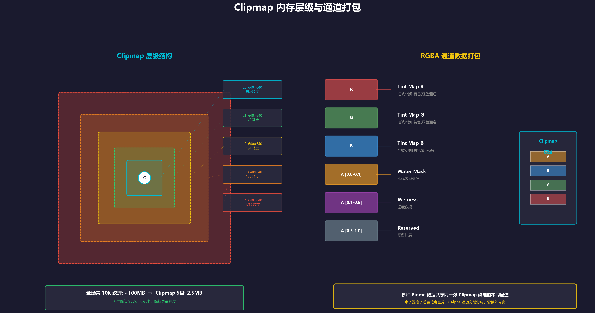
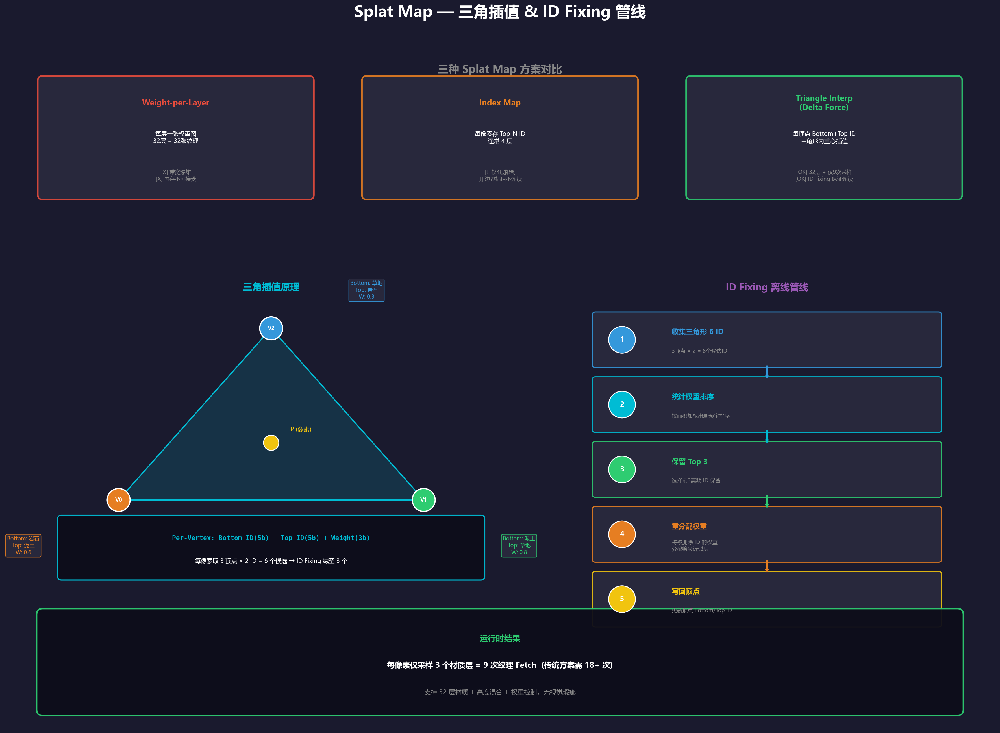
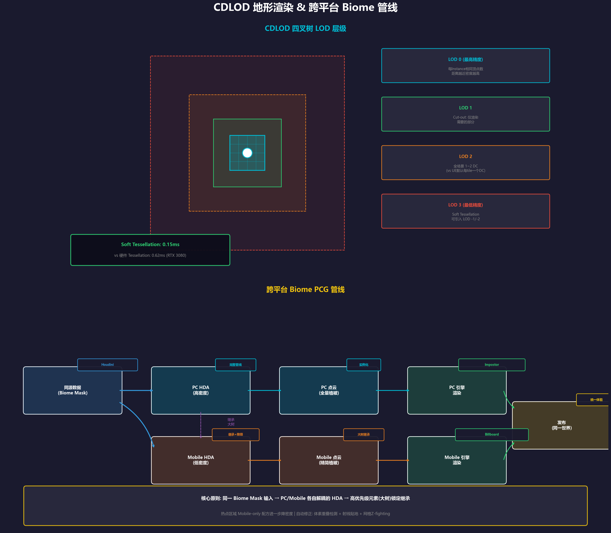
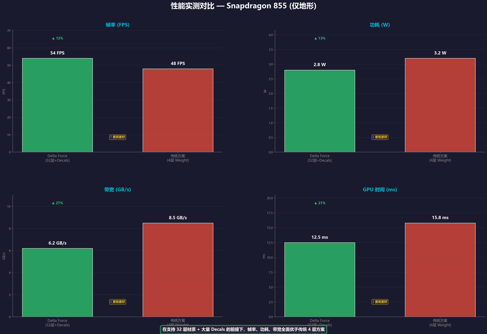

# Delta Force: Performant High-Quality Terrain and Biome Technology for PC and Mobile

> **GDC 2025** | Lichuan Wang (Technical Art Team Lead) & Hang Jiao (Engine Team Lead) | TiMi Studio Group, Tencent Games

---

## 概述

本演讲介绍了《三角洲行动 (Delta Force)》如何在 PC 和移动端同时实现高质量的地形与生态系统(Biome)渲染。核心目标：

- **物理正确的渲染** — 全 PBR 管线
- **自然开放世界** — 10km x 10km 主世界 + 多张小地图
- **跨平台统一** — PC (4K/144fps) 与移动端 (120fps 旗舰机)
- **高效与高性能** — 有限人力下兼顾两端

---

## 1. Biome Shading 跨平台框架

### 1.1 Clipmap — 核心数据载体

**问题**：10K 分辨率的全场景 Tint Map 需要 ~100MB 内存，移动端不可行。

**方案**：使用 **Clipmap**（动态纹理表示），以相机为中心分层缓存，仅保留相机附近的高精度数据。

- 内存：**100MB → 2.5MB**（降低约 98%）
- 将多种 Biome 数据打包进同一张 Clipmap 的 RGBA 通道



### 1.2 植被着色 (Vegetation Shading)

| 特性 | PC | Mobile |
|------|-----|--------|
| 健康度/季节 | Clipmap 采样 + LUT 颜色变换 | 同左 |
| 基础颜色 | BaseColor + Tint Mask | 无 BaseColor，纯灰度 Strands Mask |
| 燃烧效果 | 完整材质细节(焦叶、火星) | 仅暗色着色 |
| AO | SSRTAO + 微观 AO 纹理 | Vertex AO (同时参与假阴影计算) |
| 阴影 | 正常 CSM | Vertex AO × LoN 假阴影(省掉 CSM) |
| 草地阴影 | — | 无投射/接收，UV AO + 距离/角度衰减 |

**关键 trick**：移动端草地将位置信息烘入 Clipmap，供地形采样产生额外的直光遮蔽，改善草地-地形过渡。

### 1.3 水体着色 (Water Shading)

- 水与陆地在空间上互斥 → 共用 Clipmap 通道无冲突
- **PC**：3次余弦采样波浪法线 + SSR + IBL 反射
- **Mobile High**：2次采样，简化余弦权重
- **Mobile Low**：线性周期混合，仅采样 Absorption LUT

**深水优化**：不可见深水下的地形大幅简化着色（关闭法线、高光、阴影、GI），GPU 时钟显著下降。

### 1.4 湿度 (Wetness)

- Clipmap A 通道 [0.1-0.5] 存储湿度
- 地形高度图 + 湿度遮罩 → 生成暗部遮罩 → 水坑区域
- 其他物体（岩石等）也可读取此数据产生真实的交互效果

---

## 2. 远景植被 (Distant Foliage)

| 方案 | 平台 | 原理 |
|------|------|------|
| **Impostor** (Mesh Card) | PC Only | 多角度捕获卡片，树冠与树干分离处理，Dither TAA 平滑 |
| **Billboard** | Mobile Only | 单面/双面/倾斜面三种模式，动态调整间距防 Z-fighting |
| **Assembly Card** | Both | 将多种 Billboard 组合成条带，用于不可达区域 |

**Billboard 优化**：统一卡片尺寸 → shader 中缩放 → 利于 batching，大幅减少 DrawCall。

---

## 3. 程序化内容生成 (PCG)

### 3.1 工作流

```
Houdini (离线) → 获取地形数据 → 生成点云 → 返回引擎实例化 Biome
```

### 3.2 跨平台策略

- **同一 Biome Mask 输入** → PC/Mobile 各自解耦的 HDA 文件
- **继承关系**：锁定高优先级元素(大树)继承到移动端，剔除小灌木/装饰物
- **专用降级**：热点区域可使用 Mobile-only 配方进一步降密度

### 3.3 自动修正

| 问题 | 方案 |
|------|------|
| 植被重叠/穿插 | 体素化几何 → 3D 数组求和检测 → 自动旋转修正 |
| 草地悬浮 | 射线投射测距 → 下拉/移除/替换小模型 |
| 道路 Z-fighting (低端) | 生成 2m 网格拓扑匹配 + 顶点着色器远距上抬 |

---

## 4. 地形纹理 (Terrain Texturing)

### 4.1 Virtual Texture (VT)

- PC 和移动端均使用 **Adaptive Virtual Texture**
- 移动端实时压缩为 **ASTC 4x4 / 6x6**：
  - 带宽降至 1/4 ~ 1/9
  - PSNR 40~50，视觉可接受
  - 256x256 页面压缩仅需 0.2ms

### 4.2 Splat Map — 核心创新

**需求**：支持 32 层材质 + 高度混合 + 权重控制 + 低带宽

**方案**：三角插值 + ID Fixing



**核心思路**：
1. 每个地形顶点存储：Bottom ID (5bit) + Top ID (5bit) + Weight (3bit)
2. 每像素取周围三角形 3 个顶点 → 6 个 ID
3. **ID Fixing** 离线步骤将 6 个 ID 限制到 3 个不同层
4. 运行时只需采样 **3 个材质层**（9 次纹理采样 vs 传统 18 次）

**混合公式**：
```
BlendFactor = saturate(((Height1 - Height0) + (Weight - 0.5) * Scale) * Sharpness + 0.5)
```

### 4.3 悬崖渲染 (Cliff Rendering)

- 传统 Tri-planar 每帧额外采样开销大
- **方案**：将 Tri-planar 直接渲染进 VT（选择最佳投影平面 XY/XZ/YZ）
- 接缝修复：**Stochastic 混合**（灵感来自 Far Cry）
- 效果接近 Tri-planar，但几乎无额外每帧开销

### 4.4 远景细节增强 (Distant Detail Enhancement)

- 问题：远处地形 LOD 顶点法线精度丢失 → 地形显得平坦
- 方案：**Streaming Virtual Texture (SVT)** 离线烘焙高精度法线
- SVT 与 RVT 共享物理纹理，零额外内存

---

## 5. 地形几何 (Terrain Geometry)

### 5.1 CDLOD (Continuous Distance-Dependent LOD)

- 全场景地形仅 **1~2 Draw Calls**（vs UE 默认每 tile 一个 DC）
- 所有 instance 相同顶点数，越近越密集
- **Cut-out 技巧**：不完整细分，仅渲染需要的部分 → 减少 instance 数



### 5.2 软曲面细分 (Soft Tessellation)

- 硬件 Tessellation 的问题：性能差、三角形模式不理想、移动端不支持
- **方案**：CDLOD 自然扩展，引入 LOD -1, -2 等级
- 允许 4x4 细分（非传统 2x2），实现更快的密度衰减
- **性能**：0.15ms vs 硬件 Tessellation 0.62ms (RTX 3080)
- 已在 PC 上线，移动端中高端可行但未上线

---

## 6. 性能优化

### 6.1 内存优化

| 技术 | 效果 |
|------|------|
| Clipmap 替代全场景纹理 | 10K → 640x5 (133MB → 1.95MB) |
| Splat ID Map 也用 Clipmap | 减少 actor 加载卡顿 |
| Dynamic Texture Array | 32 层 → 动态 8 层 (85MB → 21MB) |
| VT 运行时 ASTC 压缩 | 带宽降 4~9 倍 |

### 6.2 渲染优化

- **Shader 排列组合**：根据实际层数选择 1/2/3 层 permutation（66% 区域仅 1 层）
- **移动端 RT 优化**：Frame Buffer Fetch 重排通道，减少 RT 数
- **VT Mip Bias**：开镜时维持 mip level 避免抖动

### 6.3 性能实测 (Snapdragon 855, 仅地形)



在支持 **32 层材质 + 大量 Decals** 的前提下，帧率、功耗、带宽全面优于传统 4 层 Weight-per-layer 方案。

### 6.4 跨设备缩放参数

| 参数 | 高端 | 低端 |
|------|------|------|
| VT 最大精度 | 4~8 texel/cm | Mip bias 2 |
| Heightmap 精度 | 1m | 2m |
| CDLOD 距离因子 | 全距离 | 缩短 |
| 每帧最大页面数 | 4 | 1 |
| 各向异性采样 | 4x | 无 |

**极低端设备**（无 VT）：单层/vertex、无法线图、道路独立 mesh 渲染。

---

## 7. 内存占用总表

| 配置 | VT Physical | Weightmap | DTA | CDLOD Heightmap |
|------|-------------|-----------|-----|-----------------|
| PC Ultra | 360 MB | 4.9 MB | 124.8 MB | 16 MB |
| PC Low | 64 MB | 4.9 MB | 1.95 MB | 16 MB |
| Mobile Ultra | 64 MB | 4.9 MB | 26 MB | 8 MB |
| Mobile Low | 12.8 MB | 4.9 MB | 1.625 MB | 8 MB |
| Mobile No-VT | 0 MB | 25 MB | 1.3 MB | 8 MB |

---

## 8. Key Takeaways

1. **限制复杂度** — 单一 Clipmap 承载所有 Biome 数据，跨模块统一
2. **适配双平台** — 同源数据、解耦管线、继承降级
3. **程序化方法** — Houdini 离线生成，减少人力重复工作
4. **创新 Splat Map** — 三角插值 + ID Fixing，32 层 + 权重混合 + 仅 9 次采样
5. **CDLOD + Soft Tessellation** — 1~2 DC 画全地形，0.15ms 细分
6. **性能意识** — 从 VT 压缩到假阴影，每一环节都针对移动端热量约束优化

---

## 参考文献

- [Moore] Terrain Rendering in 'Far Cry 5', GDC 2018
- [Werle] Ghost Recon Wildlands Terrain Technology and Tools, GDC 2017
- [Quilez] Biplanar Mapping, 2020
- [Riccio] Adaptive GPU Tessellation with Compute Shaders, 2019
- [Strugar] CDLOD: Continuous Distance-Dependent Level of Detail for Rendering Heightmaps, 2010
- [Gollent] Landscape Creation and Rendering in REDengine 3, GDC 2014
- [Tanner] The Clipmap: A Virtual Mipmap, 1998

---

*总结生成日期: 2025-07-02 | 原始 PDF: Jiao_Hang_Delta+Force+Performant.pdf*
