# 场景物体的渲染数据准备

> 心智模型:渲染 = **数据准备 + 渲染**。数据统一后,渲染在**同一路径族内**通用。
> **第一章 静态网格是对照组**;从第二章起,每章第一小节用**三段式**对照静态网格:**新挑战(特殊之处)→ 新问题(引入的现实问题)→ 新方案**。
> 深色主题,图由 `make_figs_01.py` / `make_figs_opt.py` / `make_figs_terrain.py` 生成。

---

# 〇、总览

## 渲染路径族(数据准备完后走哪条路)

| 路径族 | 特点 | 成员 |
|--------|------|------|
| **不透明表面** | 喂 GBuffer → 统一着色(这里才"通用") | 静态网格 / 地形 / 角色 / 植被 / 道路 |
| **Decal** | **改** GBuffer(投影覆盖) | decal |
| **透明** | 折射/反射/混合,单独 pass | 水 / 玻璃 |
| **体积** | **raymarch / 解析,不是光栅化** | 云 / 雾 / 大气 |
| **粒子 / VFX** | GPU 模拟 + sprite,overdraw | 特效 |

## 进度

```
① 静态网格(含 LOD/HLOD/剔除通用优化)✅ → ② 地形 ✅
→ ③ 角色 → ④ 植被 → ⑤ 道路 → ⑥ Decal → ⑦ 水 → ⑧⑨⑩ 云/大气/雾 → ⑪ 粒子
```

---

# 第一章 静态网格 Static Mesh(对照组 / 原型)

不透明表面物的基准,也是后面每章的对照。本章按**「需要解决的问题 → 经典如何解决 → API 发展带来的变化 → 解法如何迭代」**这条演进线组织,具体方案作为小节插入。

## 1.1 需要解决的问题

静态网格 = 有限尺寸的独立刚体。渲染要准备:几何(VB/IB)+ 材质 + 变换 + 剔除 + LOD。

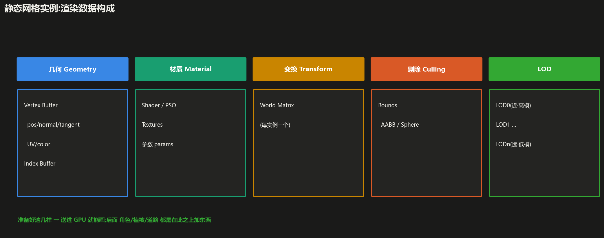

**核心矛盾**:大量物体/三角形要画,而 **CPU 逐个提交 Draw Call**。老 API(D3D11/GL)驱动单线程、每 draw 验证 + 状态切换 → **CPU 喂不动 GPU(draw-call bound)**,GPU 反而闲着。这就是一切优化的起点。

## 1.2 经典时代:如何解决(减 DC + 减几何)

思路两条:**要么少提交(减 DC),要么少画(减几何)**。

### 1.2.1 减 Draw Call:合批 / Instancing
- **静态合批**:相同材质静态物离线合并 → 少 DC,但失去单独剔除/移动
- **Instancing**(ISM/HISM):同 mesh × N transform → 1 DC 画 N 个

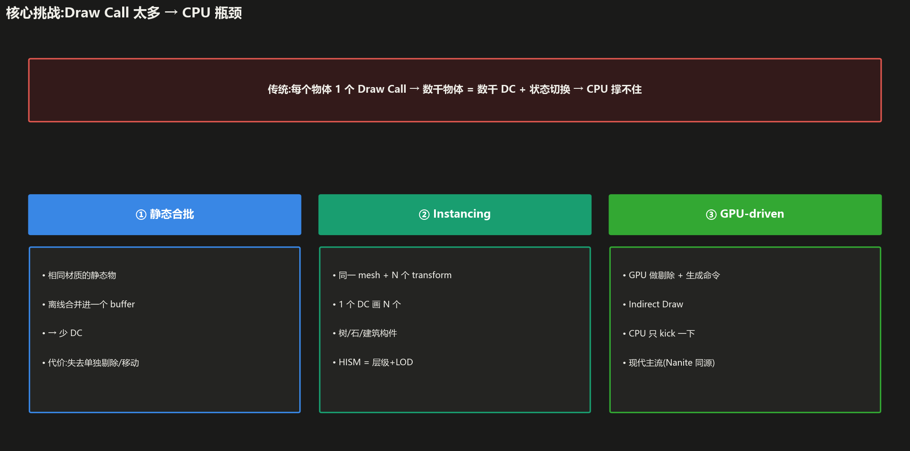
> 第三条 GPU-driven 是现代迭代,见 1.4。

### 1.2.2 减几何三件套:剔除 / LOD / HLOD
**剔除**(看不见→零成本)、**LOD**(远物体→少三角形)、**HLOD**(远景一片→合成 1 proxy 减物体数)。LOD 减「每物体三角形」,HLOD 减「物体个数」,正交互补。

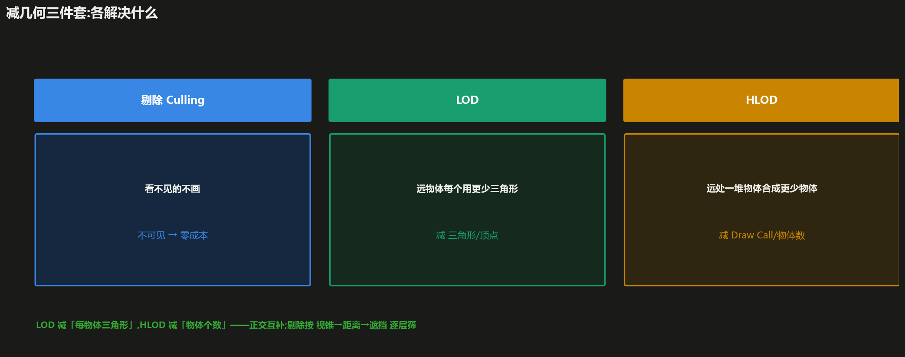

### 1.2.3 LOD:离散 LOD
LOD0/1/2 按屏幕占比切 → popping → **dither(屏幕门)+ TAA** 平滑。(Nanite 是它的极致,见 1.4)

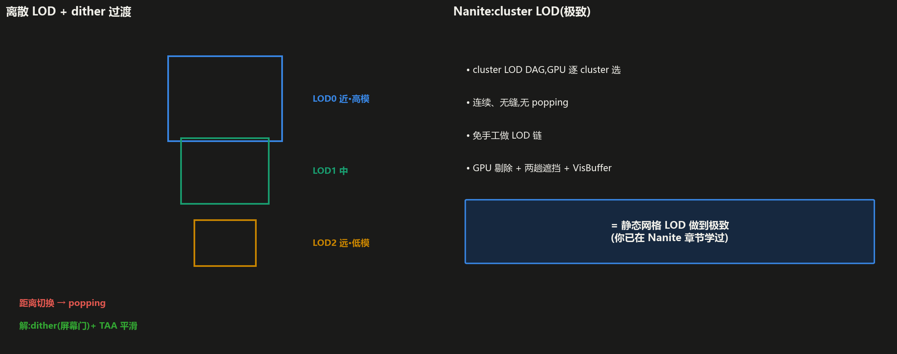

### 1.2.4 HLOD(含材质烘焙)
远处一簇物体 → 1 个 proxy(1 mesh·1 材质·1 DC)。

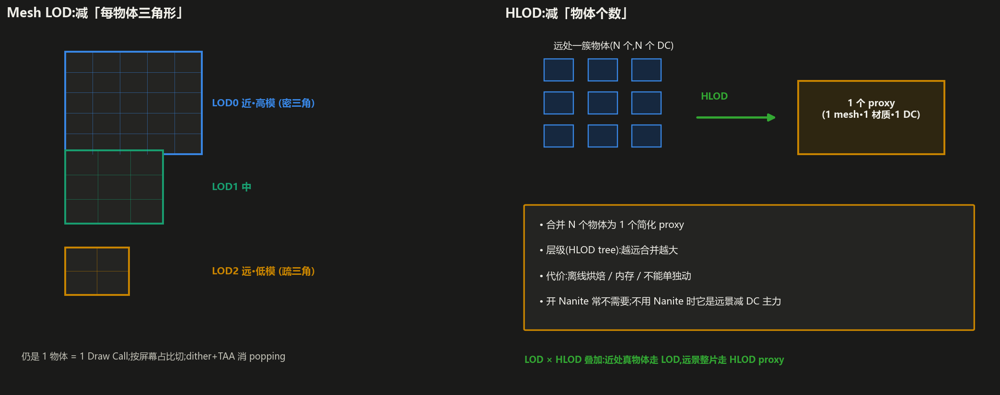

**HLOD 材质烘焙(重点)**:
- **烘的是「最终输出」,不是拷源纹理**:逐 texel 评估原 shader 跑一遍 → 采成品值写进图集
- **烘「属性」,不烘「光照」→ 高光保留**:烘 albedo/normal/roughness/metallic/AO/emissive(视角无关);高光运行时用烘好的属性 BRDF 重算;丢的是材质图里的**视角花活**(fresnel/WPO/masked/视差)
- 判据:「**光照 pass 重算 vs 材质图烘死**」——**烘 surface,不烘 shine**

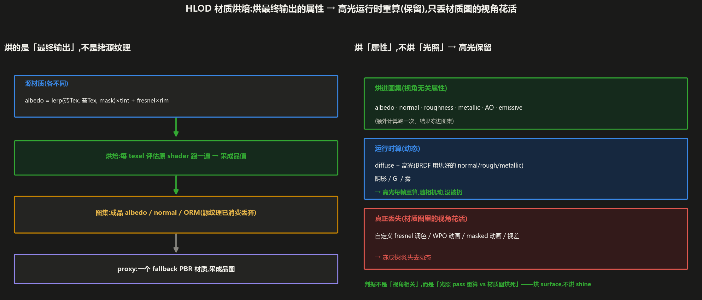

### 1.2.5 剔除 Culling
按 **视锥 → 距离/小物体 → 遮挡** 逐层筛。遮挡:HZB / Query(延迟)/ 软件遮挡 / PVS。剔除是 per-view(客户端),不影响玩法状态。

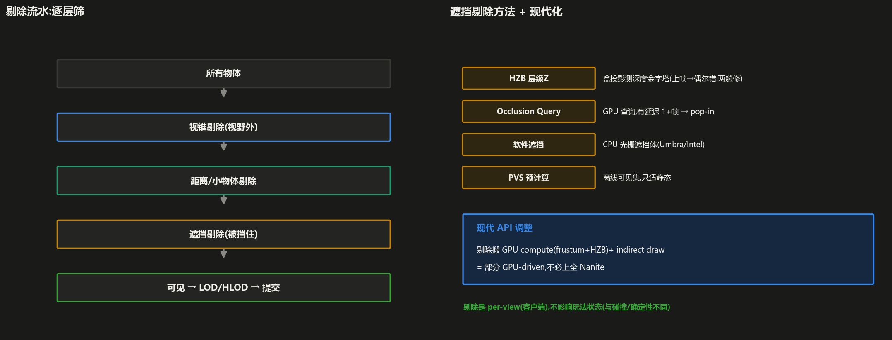

## 1.3 API 发展带来的变化

**D3D11 → D3D12/Vulkan**:per-draw 的 CPU 开销**大降**(PSO 预编译、多线程录制、bindless、无驱动 hazard)。结果:

> **瓶颈从 CPU(Draw Call)迁移到 GPU 侧**——顶点吞吐 + **小三角 quad overdraw**。带宽在 PC 上通常不是首要(移动端 TBDR 相反,带宽是王)。

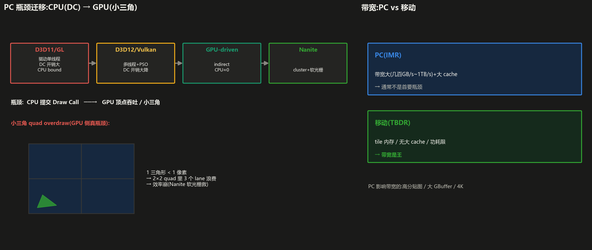

## 1.4 解法如何迭代迎接新变化

CPU 侧红利拿到后,优化重心转向 GPU 侧与"让 GPU 自己驱动"。

### 1.4.1 GPU-driven 管线
mesh / 实例 / 贴图全进 GPU buffer 按 index 访问 → **GPU 自己剔除、选 LOD、发起 draw(indirect)**,CPU 只 kick → 统一着色。这就是"数据统一 → 渲染通用"。

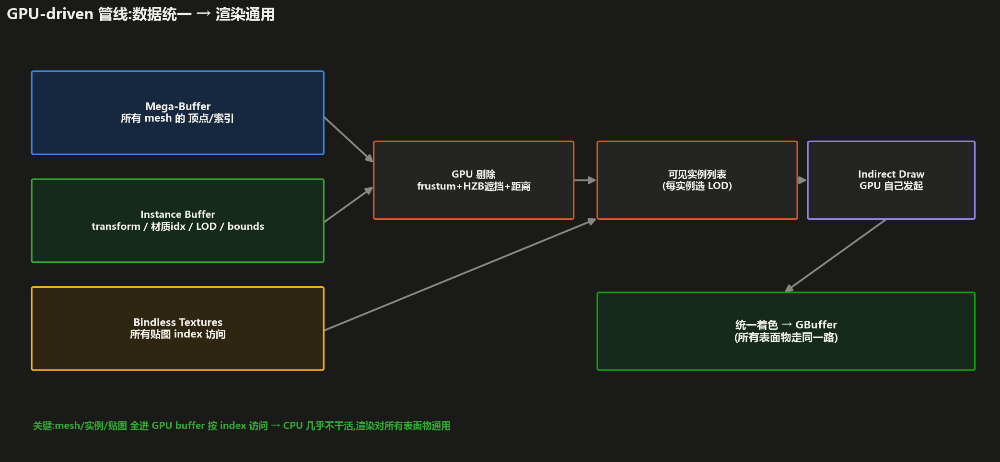

### 1.4.2 GPU-driven 是光谱,不是开关
最大杠杆其实是换现代 API(D3D11→D3D12);很多游戏止步于此。静态/不透明/海量才适合全 GPU-driven。

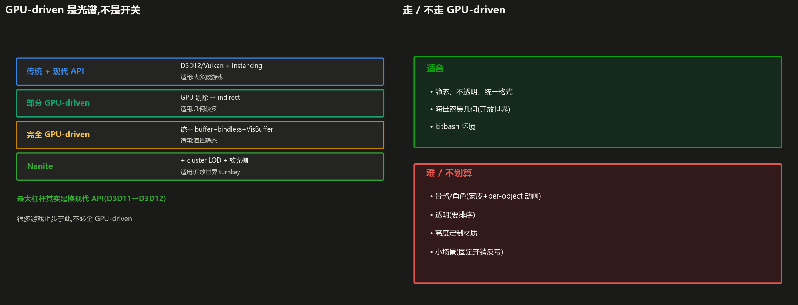

### 1.4.3 Nanite:LOD + 软光栅的极致
cluster LOD DAG + **软光栅处理小三角** + VisBuffer——同时干掉 DC 瓶颈和小三角瓶颈。但用**固定开销**换"几何越重越省"(有交叉点),骨骼/透明/Masked·WPO/移动端是短板。**移动 FPS 大概率不用。**

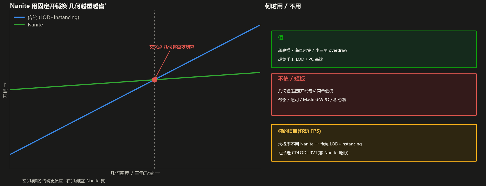

### 1.4.4 现代 API 下的传统优化总表
老策略全有效;现代 API 升级 **CPU 提交侧**(PSO + 多线程 + bindless + MDI + async),新增**时域上采样**。

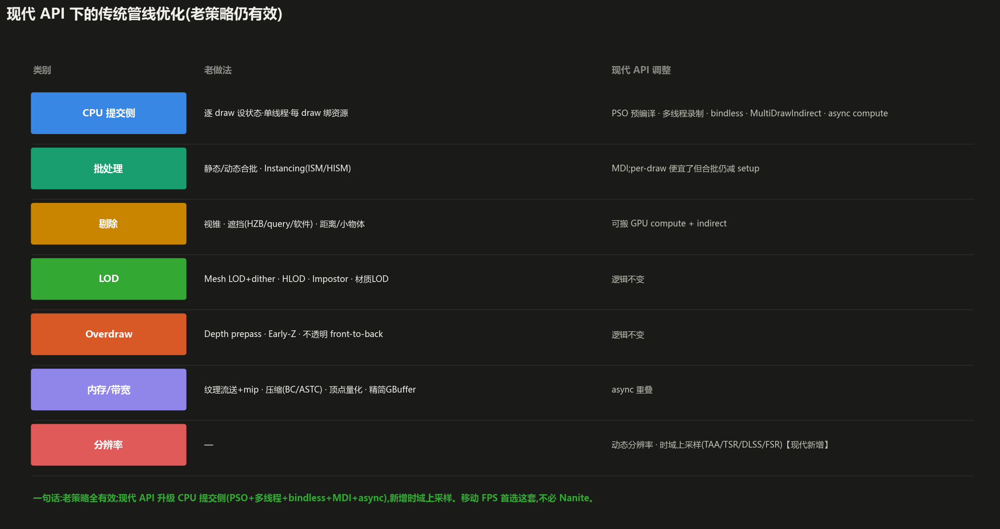

## 1.5 优先级(移动 FPS)
```
1. LOD + HLOD + 剔除  2. Depth prepass + 减 overdraw
3. 纹理/顶点压缩 + 流送  4. 动态分辨率 + 时域上采样  5. Instancing + PSO 排序
```

---

# 第二章 地形 Terrain

## 2.1 与静态网格相比:新挑战 → 新问题 → 新方案
- **新挑战**:静态网格是「有限尺寸、离散摆放的独立物体」;地形是**一张单一、连续、近乎无限大的表面**——不是"很多物体",而是"一整片"。
- **新问题**:①连续无限大 → 几何和纹理**都装不下**;②离散 LOD 会有接缝 → 要**无缝连续 LOD**;③一整片上要**几十种材质连续混合**(不能一物一材质)。
- **新方案**:**CDLOD**(连续几何 LOD)+ **clipmap/VT/RVT**(数据驻留)+ **Splat/ID Fixing**(连续多层材质)+ **Biome**(区域化组织)。下面逐一展开。

> 基于《三角洲行动》GDC 2025 分享(源 PDF/精读见同目录 `Jiao_Hang_Delta+Force+Performant.*`)。

## 2.2 术语总览
按 几何 / 纹理材质 / 光照 / 植被生产 四类速查。

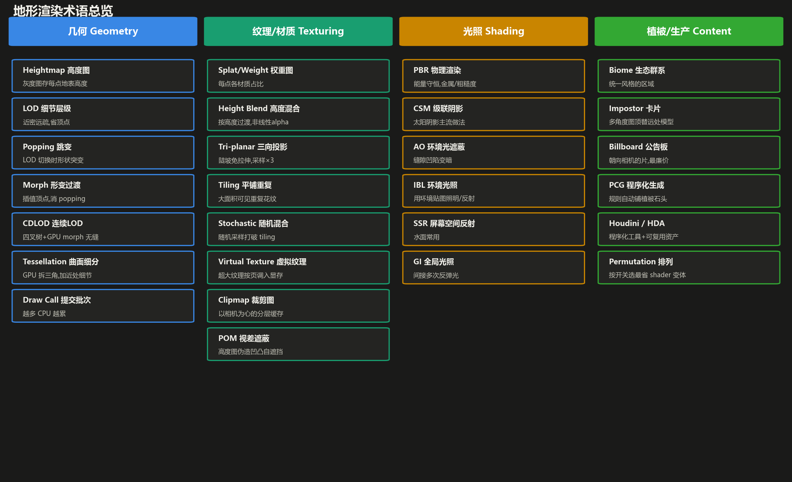

## 2.3 PC 标准做法 与 质量维度
五段式管线(几何→材质→细节→集成→光照);质量 = 8 画质维度 + 2 工程维度。

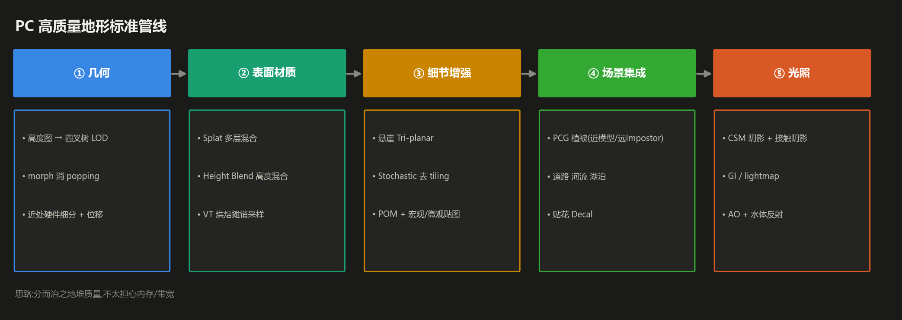
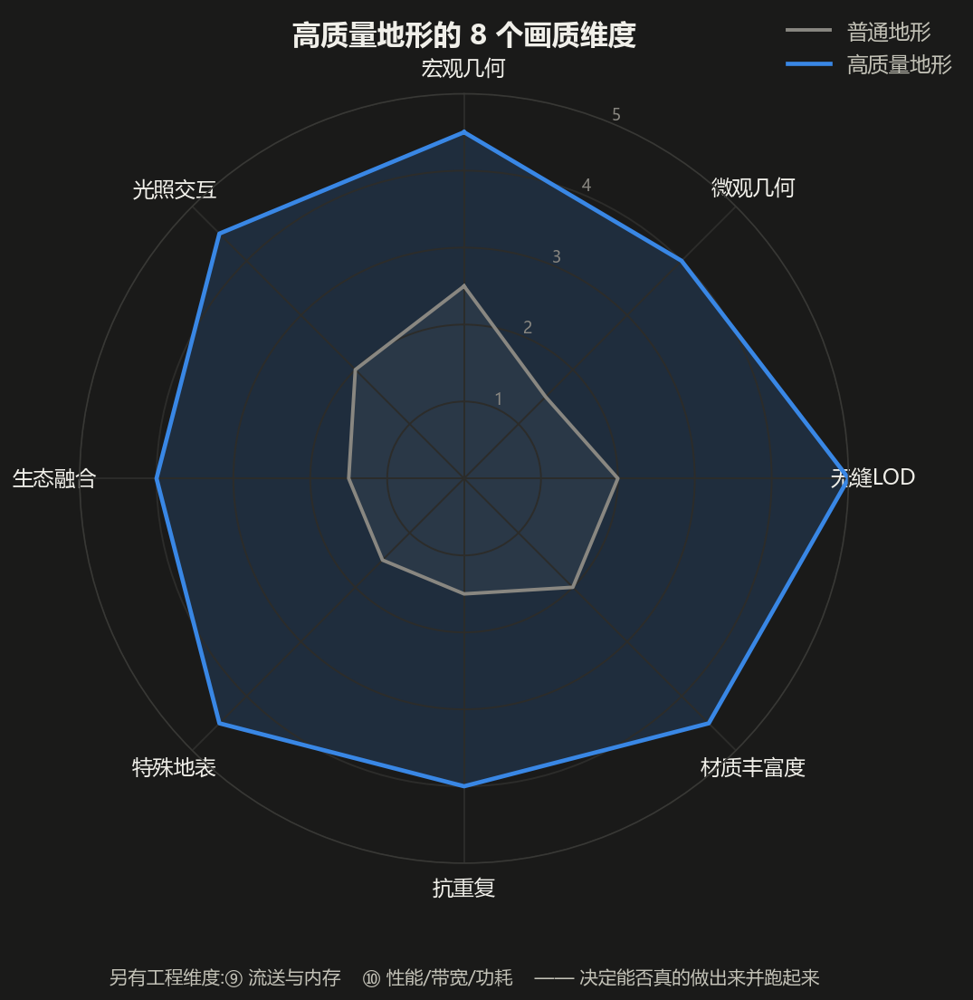

## 2.4 几何 LOD:CDLOD（解决"无缝连续 LOD"）

### 2.4.1 LOD 分级 与 morph(消跳变)
近密远疏;LOD 切换靠**顶点插值(morph)**消 popping。

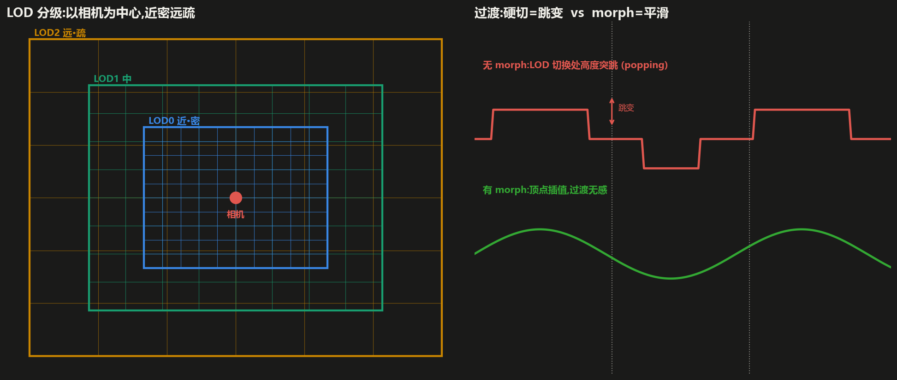

### 2.4.2 CDLOD 机制:同一网格缩放 + 四叉树划分
所有块用**同一张单位网格**缩放;近处小块多、远处大块少;四叉树 cut 是**无重叠无空隙划分**。**省的是 instance 数量**。

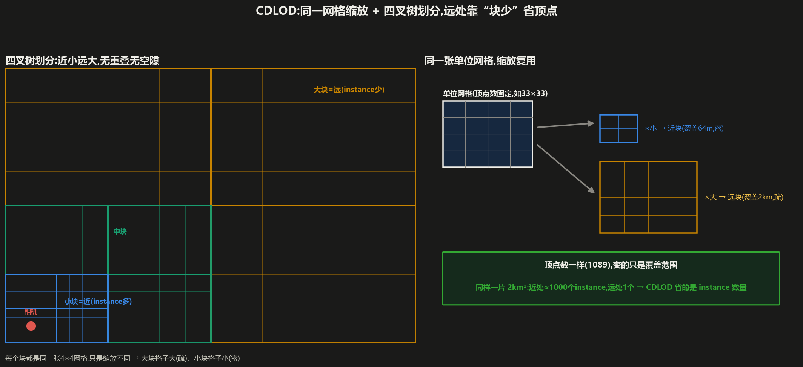

### 2.4.3 LOD级 = per-node,morphK = per-vertex
网格密度整块定;**morphK 逐顶点**算 → 共享边对齐,无裂缝。纯 VS 只能移动顶点、不能增删,故密度只能 per-node。

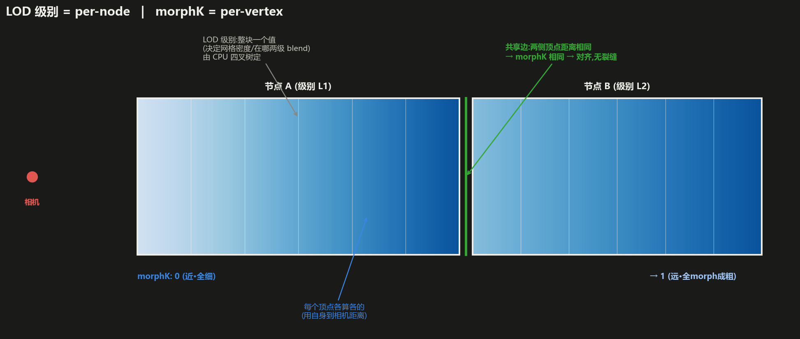

## 2.5 数据驻留:Clipmap / VT / RVT（解决"装不下"）

### 2.5.1 虚拟纹理 与 Clipmap
超大纹理只把可见页调进显存;Clipmap 以相机为心分层缓存(~100MB→~2.5MB)。

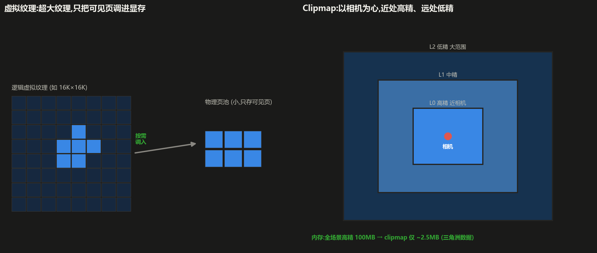

### 2.5.2 Mipmap / Clipmap / VT 三者别混
- **Mipmap** 全存;**Clipmap** 宽层裁到固定窗口 → N 张同尺寸图,相机居中;**VT** 1 张巨图切页,页表间接,只驻留可见页
- "N 张一样大"是 Clipmap 特征;UE Landscape 默认按 component 存,可选 RVT(=VT)

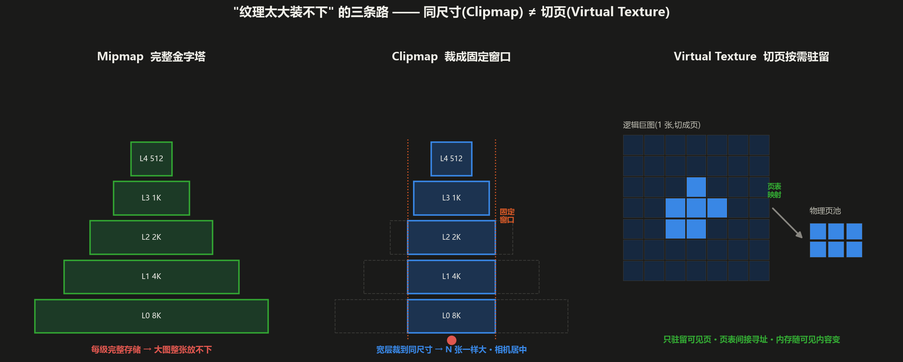

### 2.5.3 Clipmap 相机移动怎么更新(环形 toroidal)
不搬数据:当环形缓冲,**只写新进入的 L 形边条,覆盖最旧数据**,采样 `(逻辑坐标 + origin) % 尺寸`。粗层极少更新。

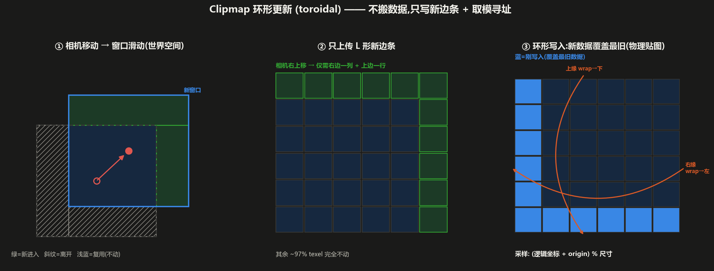

### 2.5.4 两层解耦:几何 LOD ⟂ 数据驻留
CDLOD(几何,必需)与 数据驻留(可选)正交。heightmap 装得下就全量驻留;装不下再按"要不要精确按可见性"选 clipmap / VT。

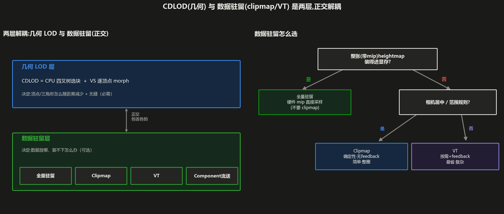

### 2.5.5 后备存储在显存外 + Clipmap vs VT + RVT
后备(权威全量)在 **显存外**(SSD/内存/生成);换入=读/算后上传;**换出=覆盖丢弃不写回**。Clipmap 确定性(无 feedback),VT 按需(GPU feedback)。

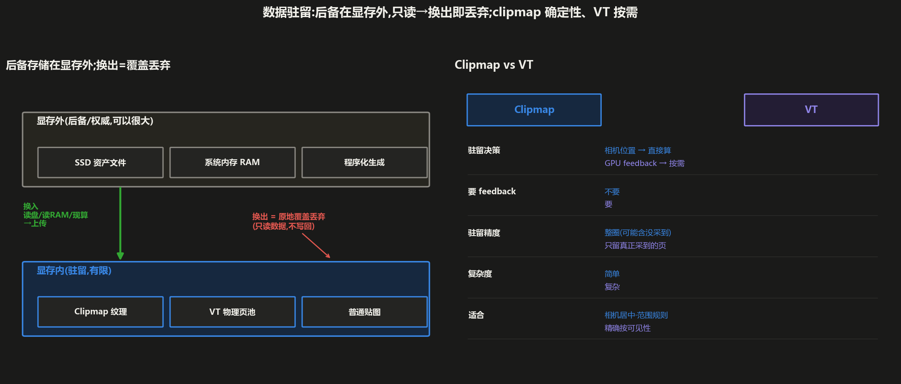

> **RVT**:把地表材质**运行时渲进 VT 页并缓存**。把"离散 splat"烘成"连续、可 mip"的材质 → 远处 minify 不闪(mip + 各向异性),还能让石头/道路/贴花采样融合。三角洲用 **Adaptive VT** + SVT 共享物理纹理 + 运行时 ASTC;相机移动只重渲"滚动前沿页",稳态开销小。

## 2.6 地表材质:Splat + ID Fixing（解决"连续多层材质"）

### 2.6.1 层混合:线性 alpha vs 高度混合
高度混合让石缝露土、犬牙交错,远比线性 alpha 自然。

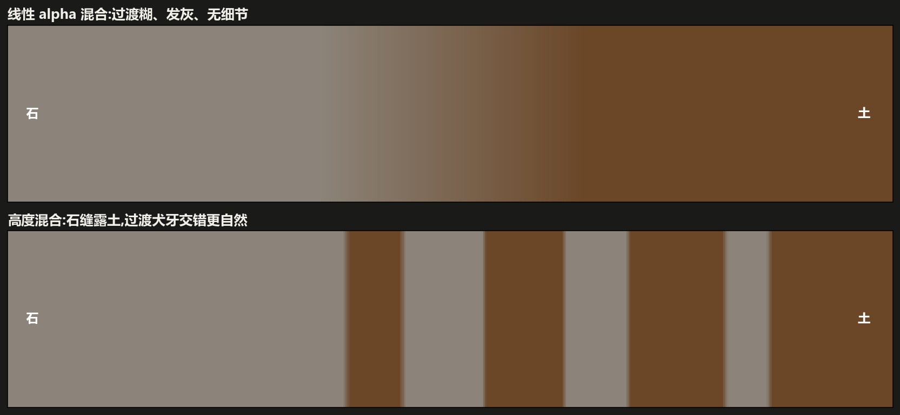

### 2.6.2 Splat + ID Fixing:32 层却固定 9 采样
索引 ID(格点存 Bottom/Top ID + Weight)+ **离线 ID Fixing 把每格三角形约束到 ≤3 层** → 运行时固定 **9 采样** 支持 **32 层**。

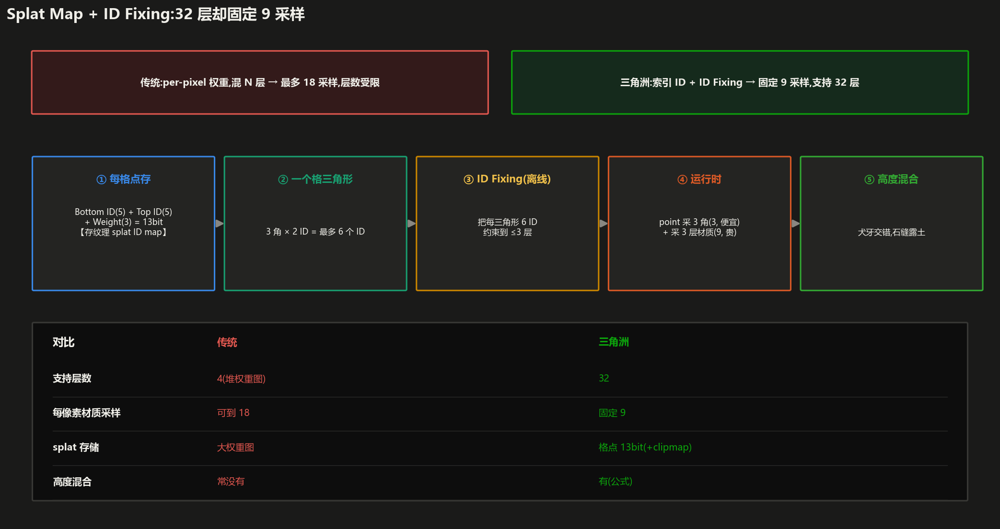

### 2.6.3 运行时:重建格三角形 + 重心算每层权重
`frac(worldXZ×scale)` 判断三角形 → **point-sample 3 角**(离散 ID 不能 bilinear)→ 6 ID(ID Fixing≤3)→ 重心加权得每层逐像素权重。

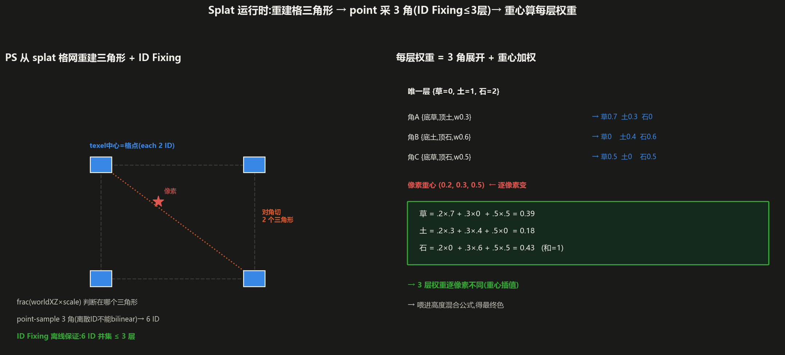

### 2.6.4 为什么不干脆提高 splat 分辨率
①存储爆炸;②**离散 ID 不能 mip → 远处闪烁(最致命)**;③带宽≠采样数(cache miss);④固定分辨率两头不讨好。粗格网+插值 = 低频可滤波 + cache 友好 + 有界。

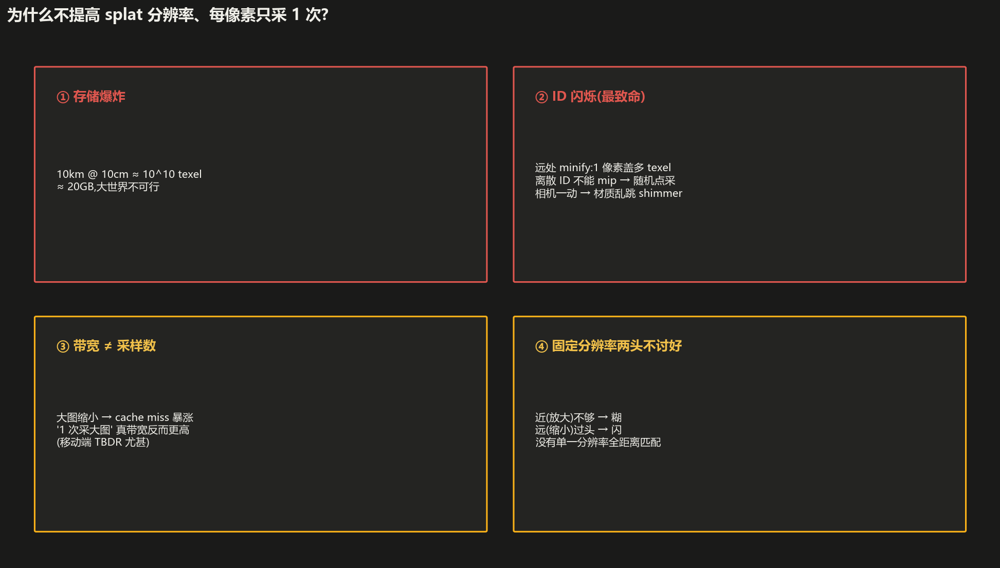

## 2.7 Biome（区域化组织）

### 2.7.1 Biome 组织:单一数据源 → 多消费者
一份 Biome Mask 喂给 **PCG(离线放置)** 和 **材质(FS,opt-in)**;clipmap + 通道打包压进移动端。

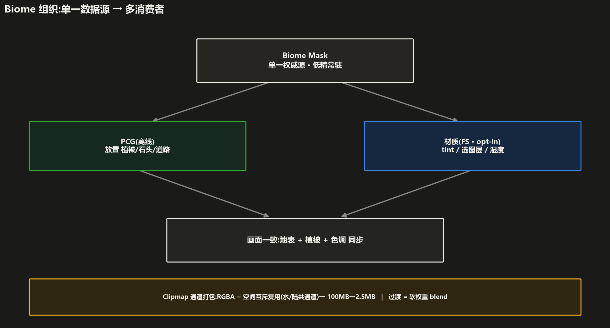

### 2.7.2 纹理即通用空间数据容器
biome/splat/height/normal/SDF/脚印… 本质都是"空间场编码进纹理、shader 采样"。分静态语义与动态交互(玩家中心 clipmap RT)。

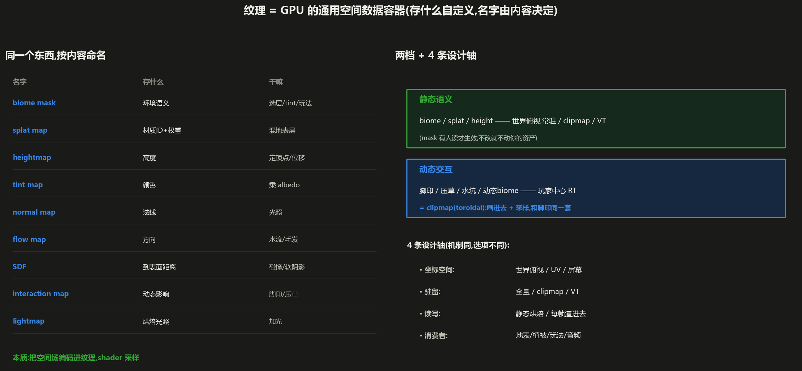

## 2.8 FPS Landscape:渲染之外的坑
渲染网格≠碰撞网格、服务器有地形不渲染、多人确定性、草的公平性、ADS 远处高 LOD、破坏/弹坑、高度场做不了悬崖/洞穴。

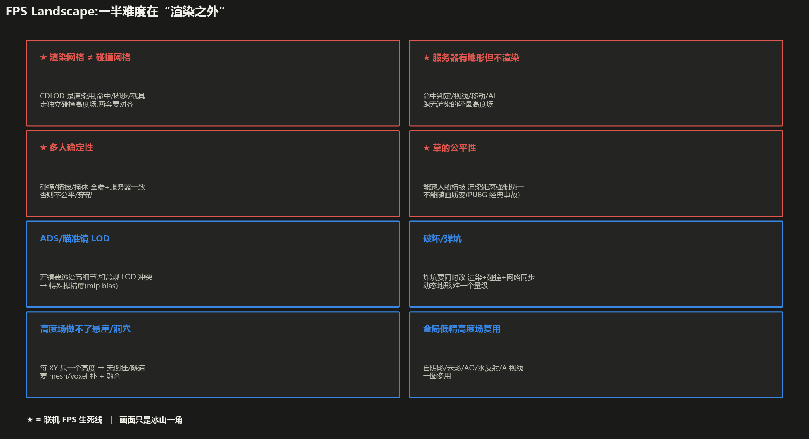

## 2.9 三角洲 Landscape 进阶技术点

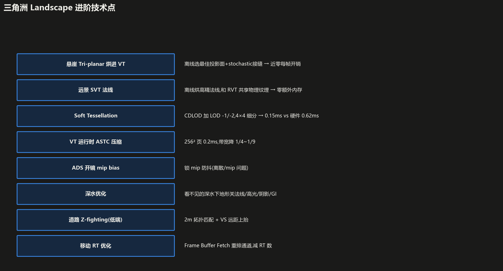

---

# 第三章 骨骼网格 / 角色

## 3.1 与静态网格相比:新挑战 → 新问题 → 新方案
- **新挑战**:角色**每帧变形**(骨骼驱动),静态网格是刚体不变形。
- **新问题**:①顶点每帧变 → 不能用固定 VB;②大量角色(人群)每个都要蒙皮;③动画数据量大;④远处角色也要简化。
- **新方案**:**GPU skinning**(骨骼矩阵 palette 在 VS 蒙皮)、Morph target、Animation LOD、**VAT**(人群把动画烘进纹理)+ instancing、Bone LOD。

## 3.2 术语总览
按 骨骼 / 动画 / 蒙皮 / 优化 四类速查。

| 类别 | 关键术语 |
|------|----------|
| 骨骼 | Skeleton、Bone Hierarchy、Bind Pose、T-Pose/A-Pose、Socket |
| 动画 | Animation Clip、Sample Rate、Keyframe、Curve、Root Motion |
| 蒙皮 | Skin Weights、Matrix Palette、Dual Quaternion、Blend Shape |
| 优化 | GPU Skinning、Animation LOD、Bone LOD、VAT、Retargeting |

## 3.3 标准做法与质量维度
角色管线 = **动画采样 → 姿态混合 → 蒙皮变形 → 渲染提交**。质量维度:动画真实感、剪影流畅度、表情细节、性能开销、内存占用、跨角色复用。

## 3.4 动画数据管线
### 3.4.1 采样与压缩
原始关键帧按固定采样率(通常 30fps)存储,经**姿态压缩**(减少关键帧、曲线拟合)降低内存。UE 提供 Additive / BlendSpace / AnimComposite 等组合方式。

**关键技术细节**:
- **ACL(Animation Compression Library)**:UE5 默认动画压缩库,由 Nicholas Frechette 开发。核心思想是对每根骨骼的旋转/平移/缩放分别选择最优量化位数(variable bit-rate),保证误差在可控范围(默认 0.01cm)内最小化存储。相比 UE4 旧压缩器,内存减少 2-4x,解压速度提升 2x。
  > 出处:Nicholas Frechette, "Animation Compression Library", GDC 2018 talk + GitHub `nfrechette/acl`

- **Curve Compression**:连续曲线可用 uniform/non-uniform B-spline 拟合,控制点数远少于原始关键帧。UE5 的 `Uniform Indexable` 编码直接支持 O(1) 随机访问任意时间点。

### 3.4.2 姿态混合
BlendSpace 按速度/方向插值;Layered Blend 分离上下半身;Additive 叠加细节抖动。混合顺序影响最终姿态稳定性。

**关键技术细节**:
- **Inertialization(惯性化过渡)**:UE5 引入的动画过渡方式,取代传统 cross-fade。状态切换瞬间记录当前速度/加速度,后续用指数衰减平滑到目标姿态,避免了 blend 两个完整动画的开销。
  > 出处:David Bollo, "Inertialization: High-Performance Animation Transitions in Gears of War", GDC 2018

- **混合流形问题**:Quaternion 插值不能简单线性(可能穿越球面内部导致体积压缩),必须用 `nlerp`(快)或 `slerp`(精确);多骨骼同时混合时 nlerp 已足够,误差在视觉阈值内。

### 3.4.3 动画共享与流送
- **Pose Caching**:UE 的 `Save Cached Pose` 节点避免同一帧内重复求值同一子树。
- **Animation Streaming**:大世界中动画资产按需加载;ACL 支持**逐 chunk 解压**,未加载 chunk 只占索引内存。

## 3.5 蒙皮与变形
### 3.5.1 GPU Skinning
每角色维护**骨骼矩阵 Palette**,VS 中用最多 4 根骨骼对顶点加权变换。矩阵通常存于 Uniform Buffer 或 SSBO。

**关键技术细节**:
- **Compute Shader Skinning**:UE5 对骨骼网格默认使用 compute dispatch 做蒙皮(而非 VS 内联),输出到 UAV buffer 供后续 pass 共享(shadow/base/velocity)。好处:避免每个 pass 重复蒙皮;坏处:需额外 buffer 存结果顶点。
  > 出处:UE5 源码 `Engine/Source/Runtime/Engine/Private/GPUSkinVertexFactory.cpp`

- **矩阵 vs 对偶四元数存储**:每骨骼 4×3 float(48B) vs DQ 2×4 float(32B)。当骨骼数 > 75 且 UBO 有 16KB 限制(移动 GLES),压缩为 DQ 可显著降低内存压力。

- **权重量化**:4 个权重通常存为 UNORM8(4 字节),但高质量项目(电影级)用 UNORM16 或 8 骨骼影响(UE5 支持 unlimited bone influences via compute skinning)。

### 3.5.2 Blend Shape (Morph Target)
对关键表情/肌肉做**顶点级偏移**,在 VS 中与骨骼蒙皮叠加,适合面部。

**关键技术细节**:
- **稀疏存储**:UE 只存储有位移的顶点(delta 编码),大幅节省内存。50 个 morph target × 10000 面的脸,实际只存 ~2000 个非零 delta/target。
- **GPU Morph Target**:UE5 用 compute shader 累加所有活跃 morph delta,输出一个最终 offset buffer,再在 skinning compute 中叠加。
  > 出处:UE5 `MorphTargets.usf` + `FMorphTargetVertexInfoBuffers`

### 3.5.3 Dual Quaternion Skinning (DQS)
传统线性混合(LBS)在关节弯折处会"体积塌陷";**对偶四元数蒙皮(DQS)**保留体积,适合大角度关节。

**关键技术细节**:
- **LBS 失败场景**:肘/膝弯曲 > 90° 时前臂截面缩为细条("candy wrapper" artifact)。DQS 解决了这个问题,但在**扭转**(twist)极端情况下会产生膨胀。
- **实际工业做法**:混合使用——大部分骨骼用 LBS(便宜),标记关节处用 DQS,通过 per-vertex flag 切换。UE5 支持 `bUseDualQuaternionSkinning` per-section。
  > 出处:Ladislav Kavan et al., "Dual Quaternions for Rigid Transformation Blending", Technical Report, 2006

### 3.5.4 Deformer Graph (UE5.4+)
UE5.4 引入 **Deformer Graph**:可视化节点系统定义任意变形逻辑(compute shader),取代固定的 skinning+morph 管线。可实现肌肉仿真、布料预测、程序化皮肤滑动等效果。
> 出处:Epic Games, "Mesh Deformer in Unreal Engine 5.4", UE Documentation

## 3.6 性能优化
### 3.6.1 Animation LOD
按距离/重要性降低采样频率、简化 BlendTree,远处角色甚至停止采样。

**关键技术细节**:
- **Update Rate Optimization (URO)**:UE 的 `UAnimInstance::SetUpdateRateParameters` 按 LOD 级别降低动画 tick 频率(LOD0=每帧,LOD1=隔帧,LOD2=每4帧)。插值使用上次姿态 → 当前姿态线性外推避免跳变。
- **Component Tick Interval**:超远角色可直接关闭 SkeletalMeshComponent tick,冻结在最后一帧姿态。
  > 出处:UE Documentation "Animation Optimization" + `FAnimUpdateRateParameters`

### 3.6.2 Bone LOD
远处角色**减少有效骨骼数**(如手指/面部骨骼剔除),降低 matrix palette 大小。

**关键技术细节**:
- **LOD Transition Section**:UE 支持 per-LOD 的 mesh section 开关,允许远处 LOD 去掉面部单独 section(含 morph target)。
- **骨骼剔除不是"删骨骼"**:是将被剔除骨骼的权重**重新分配给最近的活跃父骨骼**,在离线烘焙 LOD mesh 时完成。

### 3.6.3 VAT + Instancing
对远处同模人群,把动画帧烘进**顶点动画纹理(VAT)**,按 instance 采样,避免每角色单独蒙皮。

**关键技术细节**:
- **VAT 编码**:纹理宽 = 顶点数,高 = 帧数。每 texel 存 position offset(RGB16F 或 RGB8 + scale/bias)。VS 中用 `instanceID` 的动画时间采样对应行。
- **Houdini VAT**:SideFX 提供标准 VAT 导出工具(SOP → texture),Epic 和 SideFX 联合发布了 UE 集成教程。
- **局限**:无法做动态 blend(只能播放预烘帧序列);法线需同步烘焙第二张纹理或运行时用 `dFdx/dFdy` 重建。
  > 出处:SideFX, "Vertex Animation Textures", Houdini Documentation; GDC 2017 "Mass AI Rendering in Assassin's Creed Unity"

### 3.6.4 Parallel Animation Evaluation
UE5 默认将动画求值放在 worker thread,与 game thread 并行。骨骼矩阵计算完后通过 `FParallelAnimationCompletionTask` 回写。对于 > 50 角色的场景,并行化可减少 30-50% 动画 CPU 开销。

## 3.7 动画组织
### 3.7.1 Animation Blueprint 与 State Machine
状态机管理 Locomotion/Idle/Attack/Death 切换,BlendTree 处理移动细节;复杂角色还需 IK 和 Aim Offset。

### 3.7.2 Retargeting
不同骨架共享动画需**重定向**,保证骨骼语义一致(同名或映射表),必要时调整 Root Motion。

**关键技术细节**:
- **UE5 IK Retargeter**:基于 IK Rig 定义骨骼语义链(Spine/Arm/Leg),通过**比例适配 + IK 约束**实现跨体型重定向,比 UE4 的简单骨骼映射精确得多。
- **Root Motion Mismatch**:源动画 capsule 高度与目标不同时,需在 retarget profile 中补偿根骨骼 Z 偏移,否则角色会浮空/陷地。

## 3.8 渲染之外的坑
- **阴影**:动态骨骼网格阴影需每帧更新,远处可降级为 blob shadow 或 **capsule shadow**(UE5 内置,用胶囊体近似遮挡,极低开销)。
  > 出处:UE Documentation "Capsule Shadows"
- **碰撞与受击**:用物理胶囊体/简模做命中判定,避免用渲染网格。高精度需求(如格斗游戏)可用 **per-bone collision volumes**。
- **网络同步**:Root Motion 和动画状态需在服务器确认。常见方案:服务器只校验位移结果(authority),客户端自主播放动画(cosmetic)。
- **挂载点**:武器/饰品 Socket 需与动画同步。UE 的 Socket transform 在 `PostAnimationUpdate` 后才有效。
- **LOD Popping**:骨骼 mesh LOD 切换比静态 mesh 更明显(剪影大变),需 **dither cross-fade** 且保证 LOD 间 bind pose 一致。

## 3.9 进阶技术点
- **Motion Matching**:从海量动画片段数据库中,按当前姿态+输入意图实时选择最匹配片段,实现无状态机的流畅运动。UE5 内置 `PoseSearch` 插件。
  > 出处:Simon Clavet, "Motion Matching and The Road to Next-Gen Animation", GDC 2016 (Ubisoft)
- **Learned Motion / Neural Animation**:用 neural network 压缩动画(如 NVIDIA 的 Neural Blend Shapes)或实时生成(如 Meta 的 learned locomotion)。可将 GB 级动画库压缩到 MB 级。
  > 出处:NVIDIA, "Neural Blend Shapes", SIGGRAPH 2021
- **Cloth / Hair Simulation**:Position-Based Dynamics(PBD)是主流;UE5 的 Chaos Cloth 用 XPBD(extended PBD)保证稳定性。头发用 strand-based simulation + Marschner 散射模型渲染。
  > 出处:Müller et al., "Position Based Dynamics", 2007; Marschner et al., "Light Scattering from Human Hair Fibers", SIGGRAPH 2003
- **Facial Animation**:MetaHuman 方案 = 268 骨骼 + 680+ blend shapes + per-bone correctives;ARKit/Live Link 实时驱动 52 个 FACS 通道映射到 blend shapes。
  > 出处:Epic Games, "MetaHuman Creator" documentation; Apple ARKit Face Tracking specification

---

# 第四章 植被

## 4.1 与静态网格相比:新挑战 → 新问题 → 新方案
- **新挑战**:数量**极端巨大(百万级)** + 叶片是**半透明**片。
- **新问题**:①百万实例的提交/剔除/内存;②半透明 **overdraw**(移动端致命);③远景表达;④风动;⑤FPS 公平性。
- **新方案**:PCG+**HISM**、LOD 链(mesh→**八面体 impostor**→billboard)、**compute 生成草**、Pivot Painter 风、GPU/距离剔除、half-res、渲染距离强制统一。

## 4.2 术语总览
按 实例化 / 表达 / 材质 / 动态 四类速查。

| 类别 | 关键术语 |
|------|----------|
| 实例化 | HISM、ISM、Cluster、Chunk、Density Map、Culling |
| 表达 | Mesh Card、Impostor、Billboard、LOD、LOD Dither |
| 材质 | Alpha Test、Alpha to Coverage、Hashed Alpha、Subsurface、Two-Sided Foliage |
| 动态 | Pivot Painter、Wind Shader、Interactive Grass、Bend Normal |

## 4.3 标准做法与质量维度
植被管线 = **生成/放置 → 剔除 → LOD 选择 → 材质着色 → 风动交互**。质量维度:密度真实感、近景几何细节、远景剪影稳定、风动自然度、overdraw 控制、同屏最大实例数。

## 4.4 几何组织
### 4.4.1 HISM 与 Cluster
**层级实例静态网格(HISM)**把同 mesh 的 N 个实例合并为少量 Draw Call,支持 per-instance culling 和 LOD。内部按空间 cluster 组织,便于剔除。

**关键技术细节**:
- **HISM 内部结构**:UE 的 HISM 使用 **KD-tree** 将实例分割为 cluster(默认每 cluster ≤ 256 实例)。每 cluster 有独立 AABB,剔除时先 cull cluster 再 cull instance。当 cluster 全可见时直接提交整块,避免逐实例判断。
  > 出处:UE 源码 `HierarchicalInstancedStaticMeshComponent.cpp`
- **Instance Data Buffer**:所有 transform 打包进一个 structured buffer,VS 通过 `InstanceID` 索引读取。UE5 的 instance buffer 还包含 custom data float(最多 8 个),可传递随机色/LOD bias/风相位等。
- **内存布局**:百万草实例 × 64B/instance(transform + custom) ≈ 64MB,移动端需注意。可用 **16-bit half** transform(损失精度换省内存)。

### 4.4.2 GPU Culling
利用 compute shader 对海量实例做 frustum/distance/occlusion culling,输出 indirect draw args。CPU 只负责 kick。

**关键技术细节**:
- **两阶段遮挡剔除(Two-Phase Occlusion Culling)**:第一阶段用上帧 HZB 做保守剔除;通过的实例渲染后更新 HZB;第二阶段用新 HZB 重测第一阶段被拒绝的实例,回收误杀。
  > 出处:Wihlidal, "Optimizing the Graphics Pipeline with Compute", GDC 2016 (Frostbite)
- **Indirect Draw**:`DrawIndexedInstancedIndirect` 允许 GPU 自己填写 instance count,无需 CPU readback。所有通过剔除的 instance 索引紧凑写入 append buffer,作为 indirect 参数。
- **UE5 Nanite 的植被剔除**:Nanite 对 opaque foliage(树干)走 cluster culling;但 masked/两面叶片仍走传统 HISM + GPU cull 路径。

### 4.4.3 Compute 生成草
在 GPU 上按地形密度图生成草的位置/朝向/缩放,完全绕过 CPU 实例化,适合开阔草地。

**关键技术细节**:
- **原理**:一个 compute shader 读取地形密度贴图(per-texel 代表一片区域),按密度值决定生成多少 blade,每 blade 位置用 hash(texel coord + index) 做伪随机散布,输出到 append buffer,随后 indirect draw 渲染。
- **代表方案**:Ghost of Tsushima 的草地系统、UE 社区的 `RuntimeMeshGrass` 插件。
  > 出处:Sucker Punch, "Procedural Grass in Ghost of Tsushima", GDC 2021
- **LOD with Density**:近处每 texel 生成 N blade,远处降低到 N/4,超远直接不生成。用相机距离 step function 或连续衰减。

## 4.5 表达与 LOD
### 4.5.1 LOD 链
近景用实体 mesh;中景切换为**简化 mesh**;远景用 **impostor**(预渲染的八面体切片)或 billboard;极远可整体剔除。

**关键技术细节**:
- **Octahedral Impostor**:从 8×8 = 64 个方向预渲染树/灌木到 atlas(存 basecolor + normal + depth);运行时根据视角插值相邻两张切片。相比 billboard 的"纸片感",impostor 保留了不同角度的剪影。
  > 出处:Ryan Brucks (Epic), "Octahedral Impostors" UE Marketplace + blog series

### 4.5.2 Impostor vs Billboard
Impostor 保存多个视角的切片,视角变化时过渡更自然;Billboard 只有一张面片,适合极远处或特定视角游戏。

### 4.5.3 LOD Dither + TAA
植被切换 popping 明显,配合 dither 和 TAA/FSR 时域抗锯齿可大幅平滑。

**关键技术细节**:
- **Dithered LOD Transition 原理**:两个 LOD 在过渡区间同时渲染,各自用互补的 dither pattern 做 alpha clip(LOD0 逐渐变稀疏、LOD1 逐渐变密实),TAA 多帧累积后看起来平滑过渡。代价是过渡期间 overdraw ×2。
- **Screen-Size Based LOD**:UE 按**屏幕投影面积**(bound sphere → screen radius)决定 LOD 级别,而非简单欧几里得距离。FOV 变化时自动适应。

## 4.6 材质与光照
### 4.6.1 Alpha Test 与 Alpha Hashed
叶片用 alpha test 避免排序,但边缘锯齿严重;**alpha hashed** 配合 TAA 获得柔和半透明边缘,是高质量植被首选。

**关键技术细节**:
- **Hashed Alpha Threshold**:每像素的 clip 阈值用**屏幕空间 hash**(如 interleaved gradient noise)随机化,使边缘呈现 stochastic transparency 效果。多帧 TAA 累积后等价于 alpha blend,但走 opaque 路径(写深度、不排序)。
  > 出处:Chris Wyman & Morgan McGuire, "Hashed Alpha Testing", I3D 2017
- **Mip-Corrected Alpha**:远处纹理 mip 后 alpha 整体变小(白区缩水),需按 mip level 线性补偿 threshold,否则远处叶片"消失"过快。UE 材质节点 `OpacityMaskClipValue` 可连接 mip bias 做自动校正。

### 4.6.2 双面与次表面
树叶薄且透光,需**双面材质**和**次表面散射(SSS)**模拟背光;常用 Wrap Lighting 或预积分次表面近似。

**关键技术细节**:
- **UE Two Sided Foliage Shading Model**:专用 shading model,背面光照用**薄壳近似**——将 NdotL 反转 + 做一层散射衰减,不需完整 SSS profile,开销极低。
- **Subsurface Color**:控制背光透过叶片后的着色(通常偏黄绿),独立于 base color。
  > 出处:UE Documentation "Shading Models" → "Two Sided Foliage"

### 4.6.3 法线弯曲
foliage 法线常做"半球弯曲"或朝向相机弯曲,避免平面叶片在光照下显得僵硬。

**关键技术细节**:
- **Bent Normal 方向**:逐叶片法线 lerp 到枝干中心方向(或半球上方),使整簇树叶在侧光下呈现柔和的球面明暗,而非锐利的平面切割。
- **SpeedTree 法线风格**:SpeedTree 导出的叶片法线默认已做"球形化"(leaf mesh normal pointing outward from branch center)。

## 4.7 生成与放置
### 4.7.1 PCG 程序化生成
按 Biome Mask、坡度、海拔、水源距离等规则自动撒点;艺术家再手动修正关键区域。

**关键技术细节**:
- **UE5 PCG Framework**:5.2+ 内置 PCG 节点图,支持点生成→过滤→散布→mesh 分配全流程。可与 landscape layer weight 交互(如"只在草地层上撒草")。
- **Poisson Disk Sampling**:确保最小间距,避免扎堆;UE PCG 的 `Surface Sampler` 内部使用类 Poisson 分布。
  > 出处:Robert Bridson, "Fast Poisson Disk Sampling in Arbitrary Dimensions", SIGGRAPH 2007

### 4.7.2 运行时生成
开放世界常按相机位置动态生成/销毁植被,配合 clipmap 或 sector streaming。

**关键技术细节**:
- **World Partition + HISM**:UE5 World Partition 按 grid 加载/卸载 HISM cluster,实现植被流式。
- **GPU-Driven Runtime Spawn**:Ghost of Tsushima 风格——每帧只维护相机周围固定半径内的 grass instance buffer,超出范围的自然不渲染,无需 CPU 管理。

## 4.8 渲染之外的坑
- **碰撞**:植被通常只做视觉,碰撞用简化 proxy 或忽略。
- **导航**:草地密度影响 AI 移动代价,需同步给 NavMesh。
- **公平性**:FPS 对战需统一植被渲染距离,避免"草里有人我看不见"的竞技不公平。《三角洲行动》强制所有客户端使用相同草渲染距离。
  > 出处:GDC 2025 Delta Force talk
- **交互**:踩踏、火烧、砍草需局部更新 instance 数据或替换为动态 mesh。常用 **render target 存交互状态**(相机中心 clipmap),shader 采样该 RT 做压弯/变色。

## 4.9 进阶技术点
- **Nanite for Foliage(UE 5.3+)**:Nanite 支持 masked material(实验性),允许叶片走 Nanite cluster culling,但需 `r.Nanite.AllowMaskedMaterials=1`。树干/岩石等 opaque 部分已完全支持。
  > 出处:Epic Games, "Nanite Virtualized Geometry" UE 5.3 Release Notes
- **Half-Res Foliage Pass**:移动端将植被降至半分辨率渲染再上采样,降低 overdraw。关键是 **bilateral upsample**(用全分辨率深度引导边缘)避免"溢出"。
- **Contact Shadows**:短距离接触阴影增强草根接地感。UE 的 screen-space contact shadow 以 ~16 步 ray march 检测近距遮挡。
- **Wind System**:UE5 的 `WindDirectionalSource` + `SimpleGrassWind` 材质节点;高质量方案用 **全局风场纹理(3D Flowmap)** 驱动,顶点按 Pivot Painter 数据(分支层级/基底位置)做分层摆动。
  > 出处:Interactive Wind and Vegetation, SIGGRAPH 2019 Course (SpeedTree)

---

# 第五章 道路 / 河流(spline)

## 5.1 与静态网格相比:新挑战 → 新问题 → 新方案
- **新挑战**:形状由**样条(spline)**定义,且必须**贴合并融入地形**。
- **新问题**:①贴地 Z-fighting;②与地形边缘融合;③交叉口;④要清除沿途植被 + 更新导航。
- **新方案**:spline mesh / 贴花 / 刷 splat、VS 远距上抬、**RVT/高度混合**融合、**spline 驱动多系统**、flow map(河)。

## 5.2 术语总览
按 几何 / 材质 / 水体 / 集成 四类速查。

| 类别 | 关键术语 |
|------|----------|
| 几何 | Spline、Spline Mesh、Tessellation、Roadbed、Banking、Cross-Section |
| 材质 | Decal、Splat、RVT、Height Blend、Road Marking、Wear Map |
| 水体 | Flow Map、Riverbed、Foam、Waterfall、Shoreline |
| 集成 | Spline Component、Extrusion、Junction、Intersection |

## 5.3 标准做法与质量维度
道路/河流管线 = **spline 编辑 → 几何挤出 → 地形融合 → 材质着色 → 多系统联动**。质量维度:贴合度、过渡自然、交叉口处理、长距离曲率平滑、性能开销、编辑友好性。

## 5.4 几何生成
### 5.4.1 Spline Mesh
沿 spline 采样点,按横截面(宽度、坡度、侧坡)挤出 mesh。曲线密集处增加分段,直道减少分段以省面。

**关键技术细节**:
- **UE Spline Mesh Component**:每段 spline 生成一个 `USplineMeshComponent`,内部对源 mesh 做参数化变形(start/end tangent)。缺点是每段一个 draw call,长路需要大量 component。
- **合并策略**:成熟方案(如 RoadRunnerRT)将整条路离线合并为少数几个 StaticMesh,保留 spline 仅做编辑;运行时只渲染合并后的 mesh。

### 5.4.2 自适应细分
按曲率自动调整 segment 密度:弯道加密、直道稀疏;同时控制最小/最大分段长度避免面数爆炸。

**关键技术细节**:
- **曲率判据**:常用**相邻切线夹角**(angular deviation)> 阈值则细分;也可用 screen-space pixel error 作为自适应准则。
- **Hardware Tessellation vs Vertex Density**:移动端不支持 tessellation,必须离线/加载时生成足够密度;PC 端可用 hull shader 动态加密。

### 5.4.3 交叉口
T/Y/环岛交叉口常用预置模块拼接,或运行时布尔/融合 mesh。小规模项目可直接用贴花覆盖地面。

**关键技术细节**:
- **Intersection Mesh Blending**:成熟方案在交叉口用**多路 height blend**(类似地形 splat 但在 mesh 上),每条路贡献一个 layer,混合区域按距离权重过渡。
  > 出处:Houdini "Road Tools" SOP/HDA, SideFX 道路生成教程

## 5.5 与地形融合
### 5.5.1 Z-Fighting 避免
道路 mesh 略高于地面(几厘米)或在地形 shader 中做深度偏移;河流 bed 可略低于地形并做岸坡过渡。

**关键技术细节**:
- **Polygon Offset**:GPU 层面 `glPolygonOffset` / D3D `DepthBias` 可在不改顶点位置情况下偏移深度。但大范围 bias 会导致阴影/接触检测异常。
- **最佳实践**:Epic 官方建议道路 mesh Z 偏移 2-5cm(世界单位),配合 RVT 混合彻底消除。

### 5.5.2 RVT / Splat 融合
将道路/河流材质**写入 RVT 或地形 splat**,让地形 shader 在边界按高度/alpha 混合,消除硬边。河流 shoreline 用 SDF 或高度梯度控制湿润范围。

**关键技术细节**:
- **Runtime Virtual Texture(RVT)写入流程**:道路/贴花 actor 注册为 RVT writer;每帧(或仅移动时)将其材质渲染进 VT page;地形 shader 采样 RVT 混合。这样道路材质与地形完全融合,无几何重叠。
  > 出处:UE Documentation "Runtime Virtual Texturing"; Epic Games, "Landscape with RVT" tutorial
- **Height Blend**:道路边缘处将道路 height 与地形 height 做 max/lerp,产生自然碎石/泥土过渡,类似 Splat ID Fixing 的效果。

### 5.5.3 远距上抬
为避免远观道路陷入地形,顶点 shader 中按距离轻微上抬,补偿地形 LOD 简化带来的高度误差。

**关键技术细节**:
- **实现公式**:`worldPos.z += saturate((dist - startDist) / range) * maxLift`。`maxLift` 通常 5-20cm,视地形 LOD 最大误差而定。
- **Depth Prepass Mismatch**:上抬需在所有 pass(depth prepass/shadow/base)一致执行,否则产生 z-fighting 或 self-shadow artifact。

## 5.6 材质与特效
### 5.6.1 道路材质
包含车道线、磨损、积水、油污等细节;利用世界空间 UV 或 spline 参数化 UV 保证重复纹理不拉伸。

**关键技术细节**:
- **Triplanar / World-Aligned UV**:避免拉伸的通用方案;但道路更适合 **spline-parametric UV**(U 沿道路方向,V 横截面),保证标线/排水沟纹理对齐。
- **Puddle Detection**:利用顶点颜色或世界高度低洼区域采样一张 rain mask RT,驱动局部积水(增加 roughness=0 的反射层)。

### 5.6.2 河流水体
使用 **flow map** 驱动水面流向,结合深度生成泡沫;瀑布区域单独处理白水/雾气。

**关键技术细节**:
- **Flow Map 双层交替采样**:单层采样会随时间拉伸严重;经典做法是两层 UV 以半周期交错采样,按时间权重 lerp,消除拉伸累积。
  > 出处:Valve, "Water Flow in Portal 2", SIGGRAPH 2010; Alex Vlachos, "Water Technology of Uncharted"
- **瀑布白水**:用高密度粒子 + **vertex-animated mesh**(VAT 瀑布) + alpha 噪声模拟。

## 5.7 多系统驱动
Spline 不仅是渲染数据,还驱动:
- **植被清除**:道路/河流范围内不生成草/树。
- **导航**:自动标记为可行走/不可行走区域。
- **音频**:按 spline 触发轮胎/流水音效。
- **物理**:车辆沿 spline 简化物理模拟。

## 5.8 渲染之外的坑
- **编辑工具**:spline 控制点需要拖拽、撤销、参数面板。
- **序列化**:长 spline 数据量大,需考虑版本兼容。
- **网络同步**:河流/道路状态通常静态,但破坏/修建需同步。
- **隧道与桥梁**:涉及额外几何和遮挡关系。

## 5.9 进阶技术点
- **Procedural Bridges/Tunnels**:按 spline 自动生成桥墩、隧道入口。
- **Traffic Integration**:道路 spline 作为车流路径,与 AI 车辆系统对接。
- **Erosion Simulation**:河流对地形产生侵蚀效果,动态更新 heightmap。

---

# 第六章 Decal

## 6.1 与静态网格相比:新挑战 → 新问题 → 新方案
- **新挑战**:不是独立表面,而是**投影覆盖到已有表面**上(改别人的 GBuffer)。
- **新问题**:①overdraw;②改 GBuffer 移动端贵;③法线要跟随底面;④grazing 拉伸;⑤大量动态(弹孔)。
- **新方案**:Deferred / **DBuffer** / Mesh decal、angle fade、**法线混合**、池化+淡出+预算、移动端刷进 splat/RVT、clustered、客户端不联网。

## 6.2 术语总览
按 投影方式 / 材质 / 管理 / 质量 四类速查。

| 类别 | 关键术语 |
|------|----------|
| 投影方式 | Deferred Decal、DBuffer Decal、Mesh Decal、Projection Box、Projector |
| 材质 | Decal Material、Normal Reprojection、Angle Fade、Roughness Modification、Emissive Decal |
| 管理 | Decal Pool、Lifetime、Fade、Budget、Atlas |
| 质量 | Stretching、Z-Fighting、Popping、Sorting |

## 6.3 标准做法与质量维度
Decal 管线 = **放置/投影 → 裁剪 → GBuffer 修改 → 生命周期管理**。质量维度:贴合精度、法线跟随度、角度衰减自然、overdraw 控制、动态 budget 稳定。

## 6.4 投影与裁剪
### 6.4.1 Deferred Decal
在延迟管线下,沿 view ray 在投影体内采样深度,重建世界坐标,再采样 decal 纹理写入 GBuffer。实现简单但全屏 overdraw 高。

**关键技术细节**:
- **实现原理**:渲染一个 oriented box mesh(decal volume);pixel shader 中用 `SV_Position` 采样 depth buffer 重建世界坐标 → 转换到 decal local space → 判断是否在 [0,1]³ 内 → 是则采样 decal texture 写 GBuffer。
- **overdraw 代价**:每个 decal 覆盖的屏幕像素都要走一遍 full material evaluation,大/多 decal 叠加时 PS 开销爆炸。UE 用 `Sort by Render Order` 和 `MaxDrawDistance` 控制。
  > 出处:Pope Kim, "Screen Space Decals in Warhammer 40,000: Space Marine", 2012

### 6.4.2 DBuffer Decal
在 base pass 前将 decal 属性(normal/roughness/base color)写入专用 DBuffer,随后在 base pass 中混合。支持前向渲染,移动端更友好。

**关键技术细节**:
- **DBuffer = 3 张 RT**:DBufferA(BaseColor + opacity)、DBufferB(WorldNormal + opacity)、DBufferC(Roughness/Metallic/AO + opacity)。Base pass 读这三张 RT 做 `lerp(surface, decal, opacity)` 混合。
- **优点**:decal 只写一次 DBuffer(early pass),不会与 base pass 产生 blending order 问题;且前向渲染也能用(不依赖 GBuffer)。
- **缺点**:需额外 3 张 fullscreen RT(移动端带宽贵),且 decal material 不能用 base pass 的 lighting 信息。
  > 出处:UE Documentation "DBuffer Decals"; DICE, "Rendering of Battlefield 3" SIGGRAPH 2011

### 6.4.3 Mesh Decal
用贴合底面的几何片渲染 decal,overdraw 可控,但生成贴合几何较复杂,适合静态细节如污渍、划痕。

**关键技术细节**:
- **投影几何生成**:从 decal box 沿投影方向对场景 mesh 做交叉,生成紧贴表面的 quad strip。可离线做(工具)或加载时做(场景 build)。
- **优势**:只覆盖实际贴合面积,无 fullscreen overdraw;可参与 depth prepass/shadow。

### 6.4.4 Angle Fade
当投影方向与底面法线夹角接近 90° 时渐变淡出,消除边缘拉伸和锯齿。

**关键技术细节**:
- **实现**:`opacity *= saturate(1 - (angle / fadeAngle))`,其中 angle = `acos(dot(decalForward, surfaceNormal))`。UE 材质中直接用 `DecalMipmapLevel` 节点可得到类似效果。

## 6.5 材质与混合
### 6.5.1 法线重投影
decal 法线需从 tangent space 转换到底面切线空间,确保贴地法线连续。

**关键技术细节**:
- **Reoriented Normal Mapping(RNM)**:比简单覆盖更正确的混合方式——将 decal normal 和 surface normal 用 **detail normal blend** 算法组合,保留底面曲率。UE 材质函数 `BlendAngleCorrectedNormals` 即实现此算法。
  > 出处:Colin Barré-Brisebois & Stephen Hill, "Blending in Detail", 2012

### 6.5.2 粗糙度/金属度修改
常见用法是局部改变底面 roughness(如湿润地面变光滑、弹孔变粗糙),通常用 blend 模式叠加。

**关键技术细节**:
- **Decal Blend Mode**:UE 支持 `Translucent`(alpha blend)、`Stain`(只改 color)、`Normal`(只改法线)、`Emissive` 等 blend mode,精确控制影响哪些 GBuffer 通道。

## 6.6 移动端与优化
### 6.6.1 移动端策略
移动 TBDR 架构下修改 GBuffer 昂贵,常用方案:将 decal 烘焙进地形 splat/RVT,或用 mesh decal 减少 overdraw。

### 6.6.2 Budget 与池化
动态 decal(弹孔、血渍)使用对象池,超限时按距离/时间淡出回收;远距离 decal 降级或剔除。

## 6.7 动态 Decal 管理
- **生命周期**:出生 → 稳定 → 淡出 → 回收。
- **Atlas 打包**:静态 decal 纹理合并进 atlas 减少绑定切换。
- **Clustered**:按 tile/cluster 收集 decal,减少无效采样。

## 6.8 渲染之外的坑
- **Gameplay 标签**:decal 常与"弹孔痕迹""血迹"等游戏事件关联,需持久化或同步。
- **网络同步**:弹孔等客户端本地生成即可,不影响玩法状态。
- **持久化**:地图装饰性 decal 可静态烘焙,动态 decal 不保存。

## 6.9 进阶技术点
- **Projected Mesh Decal**:用虚拟投影纹理将复杂图案贴到任意表面,兼具 deferred 灵活性和 mesh decal 效率。
- **Signed Distance Decal**:用 SDF 表示 decal 边界,实现锐利边缘和动态变形。
- **Decal Volumes in Voxel GI**:decal 影响体素光照,增强局部间接光。

---

# 第七章 水体(透明族)

## 7.1 与静态网格相比:新挑战 → 新问题 → 新方案
- **新挑战**:**透明** + 动态波形 + 折射/反射。
- **新问题**:①波形(海/河不同);②反射(SSR 贵/噪);③折射+深度吸收;④岸线;⑤水下。
- **新方案**:Gerstner/FFT/flow map、**Single Layer Water**、planar 半分辨率反射、深度吸收+泡沫、RT 涟漪、水陆互斥共 clipmap 通道。

## 7.2 术语总览
按 波形 / 光照 / 交互 / 渲染 四类速查。

| 类别 | 关键术语 |
|------|----------|
| 波形 | Gerstner Wave、FFT、Spectral Wave、Flow Map、Normal Map |
| 光照 | SSR、Planar Reflection、Refraction、Absorption、Caustics |
| 交互 | Ripple RT、Buoyancy、Waterline、Wetness |
| 渲染 | Single Layer Water、Underwater Post-Process、Depth Fog |

## 7.3 标准做法与质量维度
水体管线 = **波形模拟 → 反射/折射 → 岸线融合 → 水下处理 → 交互反馈**。质量维度:波形真实感、反射清晰度、折射扭曲自然、岸线泡沫、水下氛围、性能开销。

## 7.4 波形模拟
### 7.4.1 Gerstner Wave
用多个方向/波长/振幅的余弦波叠加,波峰尖锐、波谷宽,适合中小规模水面。参数直观,常用于河流/湖泊。

**关键技术细节**:
- **公式**:顶点水平位移 `x += Q*A*cos(dot(D,xz)*w + t*phi)`,垂直位移 `y = A*sin(...)`;`Q`(steepness) 控制波峰尖锐度。多波叠加时 Q 的总和需 ≤ 1,否则波峰自交形成尖刺。
- **法线解析导数**:Gerstner 有闭式导数,可直接在 VS/PS 中算 normal,无需 normal map(近景仍叠加细节 normal map 增加高频)。
  > 出处:GPU Gems Chapter 1, "Effective Water Simulation from Physical Models" (Mark Finch, 2004)

### 7.4.2 FFT 海洋
基于 Phillips 频谱做快速傅里叶变换,生成连续变化的位移/法线贴图,适合大规模海洋。可预计算频谱并随时间演化。

**关键技术细节**:
- **Phillips 频谱**:`P(k) = A * exp(-1/(kL)²) / k⁴ * |dot(k_hat, wind)|²`;`L = V²/g`(风速决定的最大波长)。控制参数只有风速和方向。
- **Compute Pipeline**:① 初始化频谱(一次);② 每帧乘以 `exp(i*w(k)*t)` 做时间演化;③ IFFT 得到 displacement XYZ + derivative → 输出 3 张 displacement map + 1 张 normal map;④ VS 采样 displacement 做顶点偏移。
- **分辨率**:通常 256×256 或 512×512;用 **tiling**(平铺 world space)覆盖大海面,近处看不出重复(波在动)。
  > 出处:Jerry Tessendorf, "Simulating Ocean Water", SIGGRAPH 2001 Course Notes

### 7.4.3 Flow Map
用 2D 向量场驱动 UV 流动,表现河流转向、漩涡;常与 Gerstner 或 normal map 叠加。

**关键技术细节**:
- **双层交替消除拉伸**:`uv1 = uv + flow * frac(t); uv2 = uv + flow * frac(t + 0.5); lerp(tex(uv1), tex(uv2), abs(2*frac(t)-1))`。两层周期错开半相位,权重随时间在两者间 ping-pong。
- **Flow Map 制作**:可在 Houdini/Substance 中基于地形坡度和障碍物自动生成;也可手绘。
  > 出处:Valve, "Water Flow in Portal 2", SIGGRAPH 2010

## 7.5 反射与折射
### 7.5.1 SSR
屏幕空间反射成本低但噪点多、缺失屏幕外信息;适合中低端或作为反射补充。

**关键技术细节**:
- **Hi-Z Tracing**:用 HZB(hierarchical Z buffer)加速 ray march——先在粗 mip 大步前进,命中后退回细 mip 精确定位。UE5 SSR 默认用此方案,~16-32 步/像素。
- **抖动 + 时域累积**:每帧 ray 方向加蓝噪声 jitter,多帧 TAA 去噪。代价是运动时 ghosting。
  > 出处:Tomasz Stachowiak, "Stochastic Screen-Space Reflections", SIGGRAPH 2015 (Frostbite)

### 7.5.2 Planar Reflection
对平坦水面单独渲染一次反射 pass,清晰但昂贵;常降半分辨率并限制更新频率。

**关键技术细节**:
- **实现**:将 camera 沿水面法线镜像,设 oblique clip plane 裁掉水下部分,渲染到 RT;水 shader 采样该 RT。UE 的 `PlanarReflection` actor 即此流程。
- **开销**:相当于多渲染一次场景(几何/材质/光照全走一遍);必须限制反射 pass 的渲染距离/LOD/对象数。
- **替代**:UE5 Lumen 的 reflection 可部分替代 planar,但水面仍常用 planar 保证清晰。

### 7.5.3 折射与吸收
根据水线深度对水底场景做颜色吸收(蓝绿偏移)和模糊;浅水区折射强,深水区颜色饱和。

**关键技术细节**:
- **Beer-Lambert 吸收**:`finalColor = sceneColor * exp(-absorptionCoeff * waterDepth)`;`absorptionCoeff` RGB 不同(红吸收快 → 深水偏蓝绿)。
- **折射偏移**:`refractedUV = screenUV + normal.xz * refractionStrength / depth`;需 clamp 避免采样到水面以上像素。
- **UE Single Layer Water**:UE5 专用 shading model,在 base pass 内一次性处理折射+吸收+反射,避免额外 pass。将水面作为"单层"处理(不分正反面),适合河流湖泊。
  > 出处:UE Documentation "Single Layer Water Shading Model"

## 7.6 岸线与深度
### 7.6.1 Shoreline Foam
用深度差检测岸线与波浪接触,生成泡沫;可用 SDF 或深度纹理控制泡沫范围。

### 7.6.2 水陆互斥
河流/湖泊与地形共享 clipmap/splat 通道,确保水线处地形湿润、水陆边界无硬缝。

## 7.7 交互
### 7.7.1 RT 涟漪
玩家/物体入水时向一张运行时纹理写入涟漪,水 shader 采样该 RT 叠加波形。

### 7.7.2 浮力
CPU/GPU 根据水面高度采样计算浮力,角色/载具在水面上下起伏。

## 7.8 渲染之外的坑
- **物理同步**:水面高度需同步给物理/游戏逻辑,避免"客户端看到浪、服务器判定平地"。
- **水下体积**:进入水下需切换后处理(雾、扭曲、折射)和音频。
- **游泳状态**:角色动画/移动模式切换与水体体积绑定。

## 7.9 进阶技术点
- **Spectral Wave with Dispersion**:更精确的海浪频散关系,适合航海模拟。
- **Adaptive Tessellation**:近岸加密网格,远海稀疏,提升几何细节。
- **Underwater Caustics**:用光线追踪或预计算焦散纹理增强水下光照。

---

# 第八章 云(体积族)

## 8.1 与静态网格相比:新挑战 → 新问题 → 新方案
- **新挑战**:**没有表面**——是**体积介质(参与介质)**,不能光栅化。
- **新问题**:①体积 raymarch 极贵;②多次散射;③时间连贯;④移动端跑不动。
- **新方案**:3D noise + weather map、**低分辨率 raymarch + 时域重投影**、移动端 2.5D 云。

## 8.2 术语总览
按 建模 / 光照 / 渲染 / 动态 四类速查。

| 类别 | 关键术语 |
|------|----------|
| 建模 | Density Field、3D Noise、Weather Map、Cloud Type、Erosion |
| 光照 | Scattering、Extinction、Beer-Powder、Silver Lining、Multiple Scattering |
| 渲染 | Raymarch、Temporal Reprojection、Low-Res Buffer、Dithered Sampling |
| 动态 | Wind Advection、Coverage、Precipitation |

## 8.3 标准做法与质量维度
云管线 = **密度场生成 → 光照散射积分 → 体积 raymarch → 时域稳定 → 天气驱动**。质量维度:体积感、边缘细节、光照层次(亮边/暗肚)、动态天气、性能开销。

## 8.4 体积建模
### 8.4.1 Noise 层次
低频次 noise 控制大团形状,高频次 noise 做边缘侵蚀(erosion),weather map 控制大范围覆盖类型。

**关键技术细节**:
- **Perlin-Worley 混合 Noise**:Horizon Zero Dawn 方案用 **Perlin noise 做基础形状 + inverted Worley noise 做边缘细节**。低频(128³ 3D 纹理)定义云轮廓,高频(32³)侵蚀边缘。
- **Density Remapping**:`density = remap(baseDensity, 1-coverage, 1, 0, 1) * erosion`——coverage 控制整体云量,remap 保证覆盖区外密度为零。
  > 出处:Andrew Schneider, "The Real-Time Volumetric Cloudscapes of Horizon Zero Dawn", SIGGRAPH 2015

### 8.4.2 Weather Map
一张 2D 纹理定义某区域云量、云型、降水概率;随时间缓慢平移,驱动全局天气。

**关键技术细节**:
- **通道编码**:R=coverage(0-1), G=precipitation(控制暗度), B=cloud type(0=层云, 1=积云, interpolation=混合形态)。
- **尺度**:通常覆盖数十公里,分辨率 1024×1024(每 texel ~50m);相机移动时做 toroidal wrap 避免边界。

### 8.4.3 Cloud Type
按高度/形态分类(积云、层云、卷云等),每类用不同 noise 参数和光照散射系数。

**关键技术细节**:
- **Height Gradient**:每种云型定义一个高度密度梯度曲线(如积云底平顶圆=梯形,层云=矮宽矩形)。采样时用 `heightFraction` 查曲线得到密度缩放因子。
- **混合 Cloud Type**:weather map 的 type 值 lerp 两条相邻梯度曲线,实现连续形态过渡。

## 8.5 光照与散射
### 8.5.1 单次散射
沿 ray 采样密度,计算透射率(Beer-Powder)和向相机的散射。暗部用 ambient 填充。

**关键技术细节**:
- **Beer-Lambert 透射**:`T = exp(-sigma_t * depth)`,sigma_t = 消光系数(density × 材质常数)。
- **Powder Effect**:薄云边缘前向散射后又被反向散射出去 → 边缘反而变暗(与 Beer 相反)。近似公式:`powder = 1 - exp(-2 * density)`。最终 `energy = beer * powder`。
  > 出处:Schneider & Vos, "Nubis: Authoring Real-Time Volumetric Cloudscapes", SIGGRAPH 2017

### 8.5.2 多次散射近似
真实云内部多次散射复杂,常用**对双重散射的简化模型**或预计算 LUT 近似,表现"亮边银边"效果。

**关键技术细节**:
- **Octave Approach**:在光照 march 中做 2-3 个 octave,每个 octave:① 增加散射概率(相位函数展宽);② 降低消光系数(穿透更深);③ 微调颜色(偏暖)。叠加后模拟深层光散射。
  > 出处:Wrenninge et al., "Oz: The Great and Volumetric", SIGGRAPH 2013 (Sony Pictures); 被 Schneider 2017 简化用于实时

### 8.5.3 Silver Lining
云边缘逆光处出现亮边,由强前向散射造成;常用相位函数和人工提亮近似。

**关键技术细节**:
- **Henyey-Greenstein 相位函数**:`HG(cosTheta, g) = (1-g²) / (4π*(1+g²-2g*cosTheta)^1.5)`;g=0.8~0.99 产生极强前向峰值。实践中用**双瓣 HG**(一个前向 g=0.8 + 一个后向 g=-0.3)模拟银边和暗缘。
  > 出处:Henyey & Greenstein, 1941; Horizon ZD 使用双瓣 HG

## 8.6 渲染优化
### 8.6.1 低分辨率 Raymarch
在半分辨率 buffer 中积分,再上采样;配合 TAA/时域滤波去除欠采样噪点。

**关键技术细节**:
- **UE Volumetric Cloud 默认**:以 1/4 或 1/2 分辨率 ray march,每像素 64-128 步;生成 RGBA(inscatter + transmittance);上采样用 **checkerboard** 或 bilateral upsample。
- **步长策略**:前 16 步等距(高质量近云),后续指数增长;total march distance ~100km。

### 8.6.2 时域重投影
利用上一帧结果,减少每帧采样数;相机/天气快速变化时需注意重投影失效。

**关键技术细节**:
- **Motion Vector**:云是世界空间体积,无 per-pixel motion vector;需用**上帧 world pos → 当前帧 reproject**(考虑风偏移)。
- **Invalidation**:当 reprojected 深度与当前深度差异 > 阈值时,判定遮挡变化,强制全采样(代价是该帧局部噪点)。
  > 出处:Hillaire, "A Scalable and Production Ready Sky and Atmosphere Rendering Technique", EGSR 2020

### 8.6.3 采样优化
远近分层采样:近相机步长短,远相机步长指数增长;配合蓝噪声 dither 隐藏分层。

**关键技术细节**:
- **Blue Noise Offset**:每像素的 ray start 加一个蓝噪声 offset(从 128×128 tiling 纹理采样),使步长量化噪声呈高频分布,TAA 更易收敛。
  > 出处:Eric Heitz & Laurent Belcour, "Distributing Monte Carlo Errors as a Blue Noise in Screen Space", 2019

## 8.7 天气与动态
- **风平流**:density field 按风向缓慢移动,保持时间连续性。
- **降水过渡**:云量/厚度达到阈值时触发雨/雪,过渡需平滑。
- **日夜变化**:云在不同太阳高度下颜色变化显著。

## 8.8 渲染之外的坑
- **玩法可见性**:云不能遮挡玩家本应看到的目标,否则影响竞技公平。
- **闪电**:雷暴云需与闪电光照、音效联动。
- **空战**:飞行器穿越云层时体积感应正确。

## 8.9 进阶技术点
- **Voxel-Based Cloud**:预计算体素密度场,适合静态或半动态云层。
- **Neural Rendering Clouds**:用神经网络压缩 raymarch 结果,实时性仍在探索。
- **Cloud Shadowing**:云影投射到地面,增强整体氛围。

---

# 第九章 大气 / 天空(体积族)

## 9.1 与静态网格相比:新挑战 → 新问题 → 新方案
- **新挑战**:**全局体积散射**,尺度覆盖整个大气层。
- **新问题**:①散射积分贵;②多次散射;③aerial perspective(远物体染大气色)。
- **新方案**:**LUT 化**(transmittance/multiscatter/sky-view, Hillaire)、aerial perspective LUT、解析查表(移动端可跑)。

## 9.2 术语总览
按 散射 / LUT / 动态 / 集成 四类速查。

| 类别 | 关键术语 |
|------|----------|
| 散射 | Rayleigh、Mie、Ozone、Phase Function、Optical Depth |
| LUT | Transmittance LUT、Multiscatter LUT、Sky-View LUT、Aerial Perspective LUT |
| 动态 | Time of Day、Turbidity、Sun/Moon、Horizon Line |
| 集成 | Aerial Perspective、Fog、Exposure、Color Grading |

## 9.3 标准做法与质量维度
大气管线 = **大气参数 → LUT 预计算 → 天空/远景着色 → 场景 aerial perspective → 曝光匹配**。质量维度:昼夜过渡自然、天空色彩层次、远山雾效、太阳/月亮光晕、性能开销。

## 9.4 散射模型
### 9.4.1 Hillaire 模型
Bruneton 与 Hillaire 的大气散射模型将大气视为 Rayleigh + Mie + Ozone 三层,分别描述空气分子、气溶胶和臭氧吸收。

**关键技术细节**:
- **Rayleigh**:散射系数 ∝ 1/λ⁴(蓝光散射强 → 天蓝);scale height ~8km。
- **Mie**:散射系数近似波长无关;scale height ~1.2km;前向散射极强(g≈0.76)。
- **Ozone 吸收**:集中在 20-30km 高空,吸收峰在 ~600nm(Chappuis band),使天顶偏紫。
- **UE5 实现**:基于 Sébastien Hillaire 2020 论文,4 张 LUT(见 9.5);GPU 预计算总开销 ~0.3ms。
  > 出处:Sébastien Hillaire, "A Scalable and Production Ready Sky and Atmosphere Rendering Technique", Eurographics Symposium on Rendering 2020

### 9.4.2 相位函数
Rayleigh 散射相位对称;Mie 散射前向峰值强,产生明显的太阳周围光晕(corona)和地平线辉光。

**关键技术细节**:
- **Rayleigh Phase**:`P(θ) = 3/(16π) * (1 + cos²θ)`,对称,不依赖方向。
- **Cornette-Shanks Phase(改进 HG)**:修正 HG 在 g→1 时非物理问题;UE5 大气 shader 使用 Cornette-Shanks。
  > 出处:Cornette & Shanks, "Physically Reasonable Analytic Expression for the Single-Scattering Phase Function", Applied Optics, 1992

### 9.4.3 太阳盘
太阳本身作为强方向光源,需单独绘制盘面和强光晕;日食/月食时需动态遮挡。

**关键技术细节**:
- **角半径**:太阳视角 ~0.53°;渲染时在 sky-view pass 中用 `smoothstep(sunAngularRadius - edge, sunAngularRadius, angle)` 绘制盘面。
- **Limb Darkening**:太阳边缘比中心暗(物理正确),可用简单幂函数近似。

## 9.5 LUT 化管线
### 9.5.1 Transmittance LUT
记录从地表到太空不同高度/方向的光透射率。

**关键技术细节**:
- **维度**:2D(高度 h × cos zenith angle μ),典型分辨率 256×64。沿视线积分 optical depth,结果存为 `exp(-τ)`。
- **预计算时机**:大气参数不变时只算一次;若支持动态浑浊度则需每帧或按需重算。

### 9.5.2 Multiscatter LUT
预计算大气多次散射对天空亮度的贡献。

**关键技术细节**:
- **Hillaire 简化**:假设多次散射各向同性(散射次数越多越接近 isotropic),只需 2D LUT(h × μ_sun)。一次 compute dispatch ~64×64 → ~0.05ms。
  > 出处:Hillaire 2020, Section 5.3

### 9.5.3 Sky-View LUT
从相机位置向各方向看的天空辐亮度,用于直接采样天空颜色。

**关键技术细节**:
- **维度**:2D(azimuth × elevation),典型 192×108;每帧更新(太阳位置变)。
- **用途**:天空盒替代——不用 cubemap,而是直接采样 sky-view LUT;分辨率低但天空变化平滑,足够。

### 9.5.4 Aerial Perspective LUT
记录视线方向上大气对远处场景颜色的影响(透射 + 内散射),opaque pass 最后乘以该 LUT。

**关键技术细节**:
- **维度**:3D(screen XY + depth slice),典型 32×32×32;深度非线性分布(近密远疏)。
- **应用**:opaque 像素最终颜色 = `sceneColor * transmittance + inscatter`。UE5 在 post-process 阶段用 `GetAerialPerspectiveLuminanceTransmittance()` 采样并应用。
  > 出处:UE5 源码 `SkyAtmosphereRendering.cpp`; Hillaire 2020 Section 6

## 9.6 动态天空
### 9.6.1 Time of Day
太阳/月亮位置、颜色、强度随时间变化;黄昏/黎明时大气散射最复杂,色彩层次最多。

### 9.6.2 Turbidity
浑浊度控制 Mie 散射强度,影响雾蒙蒙程度和地平线亮度。

## 9.7 与场景集成
### 9.7.1 Aerial Perspective on Opaque
远处物体被大气色调染,同时亮度按距离衰减;与雾(fog)统一处理避免重复。

### 9.7.2 曝光与色调映射
大气亮度动态范围极大,需与自动曝光、eye adaptation、tone mapping 协调。

## 9.8 渲染之外的坑
- **玩法可见性**:雾天/黄昏不能过度影响玩家识别敌人。
- **颜色分级**:天空颜色需与后期调色匹配,避免突兀。
- **性能稳定**:LUT 更新频率应低于每帧,太阳移动慢时不必每帧重算。

## 9.9 进阶技术点
- **Volumetric Aurora**:极光作为高层大气粒子发光,可用射线或体素模拟。
- **Procedural Night Sky**:程序化星空、银河、月光散射。
- **Planet Curvature**:大尺度开放世界需考虑地表曲率对大气散射的影响。

---

# 第十章 体积雾(体积族)

## 10.1 与静态网格相比:新挑战 → 新问题 → 新方案
- **新挑战**:局部**参与介质**,且受光源/阴影影响。
- **新问题**:①逐像素 raymarch 贵;②光照散射。
- **新方案**:**Froxel(视锥体素)**累积散射(Wronski)、时域累积。

## 10.2 术语总览
按 数据结构 / 光照 / 密度 / 渲染 四类速查。

| 类别 | 关键术语 |
|------|----------|
| 数据结构 | Froxel、Voxel、Frustum Voxelization、3D Texture |
| 光照 | Scattering、Extinction、Phase Function、Light Injection |
| 密度 | Height Fog、Density Texture、Local Volume、Noise |
| 渲染 | Temporal Accumulation、Blur、Integration、Raymarch |

## 10.3 标准做法与质量维度
体积雾管线 = **Froxel 化分 → 密度注入 → 光照注入 → 散射积分 → 时域滤波 → 叠加到场景**。质量维度:体积光柱、阴影穿透感、密度过渡自然、噪点控制、性能开销。

## 10.4 Froxel 管线
### 10.4.1 Frustum Voxelization
将视锥划分为 3D 体素(Froxel),通常深度方向非均匀分布(近密远疏)。

**关键技术细节**:
- **名称来源**:Froxel = **Fr**ustum v**oxel**,由 Bart Wronski(CDPR/Activision)在 Assassin's Creed 4 中推广。
- **深度分布**:通常用**指数分布** `z(i) = near * (far/near)^(i/numSlices)`,使近处切片密(保证近景精度),远处稀(远景精度要求低)。也有用 `lerp(linear, exponential, 0.5)` 混合的。
- **典型分辨率**:UE5 默认 160×90×64(=~920K froxels);每帧写入 3D texture(RGBA16F 存 inscatter+transmittance)。
  > 出处:Bart Wronski, "Volumetric Fog: Unified Compute Shader Based Solution to Atmospheric Scattering", SIGGRAPH 2014 (Ubisoft)

### 10.4.2 密度注入
将高度雾、局部体积雾、噪声、天气参数写入 froxel 密度 3D 纹理。

**关键技术细节**:
- **Compute Dispatch**:一个 CS 遍历所有 froxel,累加所有密度源(全局高度雾指数衰减 + 局部体积 actor 的 SDF 或 OBB 判断)。
- **密度公式(高度雾)**:`density(h) = globalDensity * exp(-falloff * (h - fogHeight))`。`falloff` 越大雾越贴地。
- **局部覆盖**:UE `ExponentialHeightFogComponent` 允许放置 `VolumetricFogVolume` 做局部密度/颜色覆盖。

### 10.4.3 散射积分
对每个 froxel,沿视线方向累积散射和消光,得到该像素的雾颜色和透射率。

**关键技术细节**:
- **前向累积(Front-to-Back)**:从相机近面向远面逐 slice 累积:`inscatter[i] = inscatter[i-1] * T[i] + scattering[i]`;`T[i] = T[i-1] * exp(-extinction[i] * sliceDepth)`。最终结果:每像素 = 累积 inscatter + 场景色 × 累积 transmittance。
- **这是一个串行操作**:64 个 slice 必须顺序累积(数据依赖),CS 中需用 loop + shared memory 或直接 per-pixel serial。
  > 出处:Wronski 2014; UE5 `VolumetricFog.usf`

## 10.5 光照注入
### 10.5.1 阴影采样
每个 froxel 向光源方向采样 shadow map,决定该处是否被照亮;透射雾中可见明显光柱。

**关键技术细节**:
- **Shadow Map 采样**:将 froxel 世界坐标变换到光源 shadow space,采样 CSM/spotlight shadow map 得到 shadow factor;shadow=1 该 froxel 被照亮,=0 在阴影中。
- **光柱效果**:当阴影边缘穿过体积雾时,照亮区域(light shaft)和阴影区域形成明暗条带——这就是 God Rays 的物理正确来源。
- **Volumetric Shadow**:对于体积光源(如烟雾中的聚光灯),需额外对光方向做 ray march 计算自阴影。

### 10.5.2 局部光源
点光源/聚光灯按距离注入 froxel,形成局部体积光。

**关键技术细节**:
- **Light Culling**:每个 froxel 判断是否在光源影响范围内(与 clustered lighting 类似);通常用 **light tile/cluster** 加速。
- **IES Profile**:聚光灯可带 IES 光照分布,体积雾也受其影响,产生独特的 pattern 光柱。
  > 出处:UE Documentation "Volumetric Fog and Mesh Distance Fields"

### 10.5.3 时域累积
每帧随机抖动采样,多帧累积降低噪点;相机移动时做重投影。

**关键技术细节**:
- **Temporal Filter**:UE5 默认用 **exponential moving average**:`result = lerp(historyResult, currentResult, 0.05)`(~20帧收敛)。
- **重投影**:用上帧 depth/velocity 将当前 froxel 对应到上帧位置;若对应位置不可信(被遮挡/出屏幕)则增加当前帧权重(接受噪点)。
- **Halton Jitter**:每帧的 ray offset 用 Halton 序列产生低差异抖动,比纯随机收敛更快。

## 10.6 材质与密度控制
### 10.6.1 高度雾
密度随高度指数衰减,模拟低空雾/地面烟尘。

### 10.6.2 局部体积
可放置雾体积 actor,局部覆盖密度、颜色、散射系数,用于洞穴、室内、毒雾区。

### 10.6.3 噪声
3D noise 或 flow noise 让雾边缘不规则,避免"塑料盒"感。

## 10.7 优化与质量
### 10.7.1 半分辨率 Froxel
移动端或性能紧张时降采样 froxel,再双边上采样保持边缘。

### 10.7.2 Blur 与滤波
对散射结果做空间模糊,进一步抑制高频噪点。

## 10.8 渲染之外的坑
- **潜行玩法**:雾影响 AI 视野和玩家可视距离,需同步给玩法系统。
- **天气过渡**:雾密度需随天气平滑过渡,避免突变。
- **室内/室外**:体积雾与局部后处理边界需处理干净。

## 10.9 进阶技术点
- **God Rays / Light Shafts**:强光源方向上的体积光柱,可单独 pass 或集成进体积雾。
- **Volumetric Clouds Integration**:云影影响体积雾光照,增强天气一致性。
- **Reprojection-Aware Blur**:运动场景下保持体积雾稳定。

---

# 第十一章 粒子 / VFX

## 11.1 与静态网格相比:新挑战 → 新问题 → 新方案
- **新挑战**:大量**动态生成、短命的 sprite**,GPU 模拟。
- **新问题**:①数量大;②半透明 overdraw;③碰撞;④透明排序。
- **新方案**:**GPU 模拟(Niagara)** + vector field、half-res+上采样、**SDF 碰撞**、mesh/ribbon particle、排序/OIT。

## 11.2 术语总览
按 模拟 / 形态 / 碰撞 / 渲染 四类速查。

| 类别 | 关键术语 |
|------|----------|
| 模拟 | Emitter、Spawn、Update、Kill、GPU Simulation、Vector Field |
| 形态 | Sprite、Ribbon、Mesh Particle、Trail、Beam |
| 碰撞 | SDF Collision、Depth Collision、GPU Event |
| 渲染 | Overdraw、OIT、Sorting、Half-Res、Atlas |

## 11.3 标准做法与质量维度
VFX 管线 = **发射器配置 → 粒子模拟 → 碰撞/事件 → 渲染排序 → 生命周期回收**。质量维度:视觉冲击力、随机自然性、与场景交互、overdraw 控制、性能预算稳定。

## 11.4 模拟管线
### 11.4.1 CPU vs GPU Simulation
CPU 适合复杂逻辑和事件触发;GPU 适合大规模简单粒子(雨、雪、火花)。

**关键技术细节**:
- **UE Niagara 架构**:Niagara 支持 CPU/GPU 两种 sim target。GPU sim 用 compute shader,每 emitter 一个 dispatch;粒子数据存于 structured buffer(position/velocity/age/custom)。
- **GPU → CPU Readback**:碰撞事件/spawn 回调需 readback,有 1-2 帧延迟;Niagara 的 `GPU Compute Sim Stage` 可链式串联多个 CS 避免中间 readback。
- **Hybrid**:复杂 VFX 常用 hybrid——CPU emitter 控制逻辑(spawn 率、burst timing、event),GPU emitter 做实际粒子模拟。
  > 出处:Epic Games, "Niagara Technical Reference" UE Documentation

### 11.4.2 Spawn/Update/Kill
每帧按发射率生成新粒子,更新位置/速度/颜色/尺寸,超寿命或超边界则回收。

**关键技术细节**:
- **Dead List & Free List**:GPU 粒子用 **append/consume buffer** 管理粒子索引;新粒子从 free list consume,死亡粒子 append 回去。避免紧凑化(compaction)开销。
- **Deterministic Simulation**:Niagara 支持 deterministic random(固定 seed),保证 replay 一致性,适合过场/回放。

### 11.4.3 Vector Field
用 3D 向量场驱动粒子流动,模拟风、爆炸冲击波、魔法能量。

**关键技术细节**:
- **格式**:通常存为 16-bit half float 3D texture(32³~128³);Houdini/EmberGen 等工具导出。
- **采样**:每帧在粒子位置做 trilinear 采样得 force/velocity 增量;多个 vector field 可叠加。
- **Curl Noise**:一种特殊 vector field——**无散度**(divergence-free),粒子不会聚集或发散,适合烟雾流动。
  > 出处:Robert Bridson et al., "Curl-Noise for Procedural Fluid Flow", SIGGRAPH 2007

## 11.5 渲染形态
### 11.5.1 Sprite
billboard 面片,最简单,适合火花、烟雾、光斑。

**关键技术细节**:
- **Billboard 类型**:Camera-facing(始终朝相机)、Velocity-aligned(沿速度方向拉伸)、Axis-aligned(固定一个轴)。Niagara `Sprite Facing Mode` 控制。
- **Sub-UV / Flipbook**:一张 atlas 存多帧序列,按 age 播放;配合 `SubUV Blending` 插值相邻帧避免跳变。

### 11.5.2 Ribbon / Trail
沿粒子路径生成带状 mesh,适合刀光、尾迹、魔法轨迹。

**关键技术细节**:
- **Tessellation**:Niagara ribbon 自动在控制点间插入 Catmull-Rom 曲线段,保证平滑;通过 `TessellationFactor` 控制细分密度。
- **UV 模式**:沿 ribbon 方向 U 从 0→1(stretch)或 tile;V 跨宽度 0→1。支持 distortion/dissolve 动画。

### 11.5.3 Mesh Particle
用实体 mesh 渲染粒子,适合碎石、弹片、debris。

**关键技术细节**:
- **Instanced Rendering**:所有同 mesh 的粒子用 **instanced draw** 一次提交;transform 来自粒子 buffer。
- **LOD**:Niagara mesh renderer 支持按距离/屏幕大小 cull mesh particle,或切换简化 mesh。

## 11.6 碰撞与交互
### 11.6.1 SDF Collision
用场景 signed distance field 做快速碰撞反弹,适合 GPU 粒子。

**关键技术细节**:
- **Global Distance Field**:UE5 维护一个**全局 SDF**(低分辨率 cascaded volume texture);GPU 粒子每帧采样该 SDF,距离 < threshold 则反弹(反射速度 + 摩擦)。
- **精度限制**:全局 SDF 分辨率低,细小物体可能穿透;重要碰撞体可额外用 per-mesh SDF 精确化。
  > 出处:Daniel Wright (Epic), "Dynamic Occlusion with Signed Distance Fields", SIGGRAPH 2015

### 11.6.2 Depth Collision
用深度图做屏幕空间碰撞,成本低但只支持相机可见面。

**关键技术细节**:
- **实现**:将粒子投影到屏幕空间,比较粒子深度与 depth buffer;若粒子深度 > scene depth(穿入表面),则回退到表面并反弹。
- **局限**:只知道表面前方有物体,不知道厚度;粒子从侧面/背面穿入时无法检测。

### 11.6.3 GPU Event
粒子碰撞时触发事件(如落地产生 secondary burst、decals)。

**关键技术细节**:
- **Niagara Events**:碰撞时写入 event payload(位置、法线、速度);另一个 emitter 订阅该事件做 secondary spawn。GPU→GPU event 无 CPU roundtrip,延迟极低。
- **Spawn on Death**:粒子死亡时也可触发 event,常见用法:火花落地 → 产生烟尘 emitter。

## 11.7 优化与排序
### 11.7.1 Overdraw 控制
限制半透明粒子填充率,远处降低发射率,近处控制尺寸。

**关键技术细节**:
- **Fill Rate Budget**:移动端目标 < 4x overdraw;UE Niagara 的 `Scalability` 系统按平台自动降低 spawn rate / max count。
- **Soft Particle**:靠近 opaque 表面的粒子用 depth fade 做柔和过渡(避免硬切割),同时可做 near-camera fade 避免"糊脸"。

### 11.7.2 排序与 OIT
传统 CPU 排序适合少量粒子;大量或复杂重叠时用 Order-Independent Transparency(OIT)或按 emitter 局部排序。

**关键技术细节**:
- **GPU Radix Sort**:大规模 GPU 粒子排序用 parallel radix sort on depth key;Niagara 内置 `SortMode = View Depth` 选项。
- **Weighted Blended OIT(McGuire & Bavoil 2013)**:不排序,按 `weight(z, alpha)` 加权累积;适合烟雾/雾这类低频半透明,不适合尖锐边缘。
  > 出处:Morgan McGuire & Louis Bavoil, "Weighted Blended Order-Independent Transparency", JCGT 2013

### 11.7.3 Half-Res + Upsample
对柔焦、烟雾类特效降半分辨率渲染,再双边滤波上采样。

**关键技术细节**:
- **Separate Translucency in UE**:UE5 的 "Separate Translucency" 将低频半透明(如雾、烟)渲染到 half-res RT,base pass 后做 bilateral composite。高频特效(如火花)仍走全分辨率。
- **Depth-Aware Upsample**:上采样时检查相邻像素深度差异,差异大的边界处不混合(保持锐利);差异小的区域做 bilinear 插值。

## 11.8 渲染之外的坑
- **Gameplay 事件触发**:爆炸、技能命中常与粒子系统联动,需确保时序正确。
- **网络同步**:大部分 VFX 本地播放,但由服务器触发的事件需同步触发信号。
- **音效同步**:粒子 burst 常与音效绑定,注意延迟。

## 11.9 进阶技术点
- **VFX Graph / Node-Based**:可视化脚本配置复杂粒子行为。
- **Sparse Simulation**:只模拟可见/受影响区域的粒子。
- **Neural Particles**:用神经网络驱动或压缩粒子运动,仍在研究阶段。
