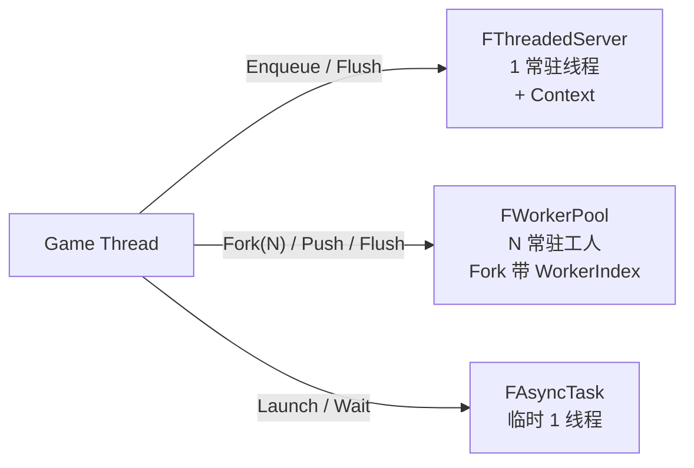
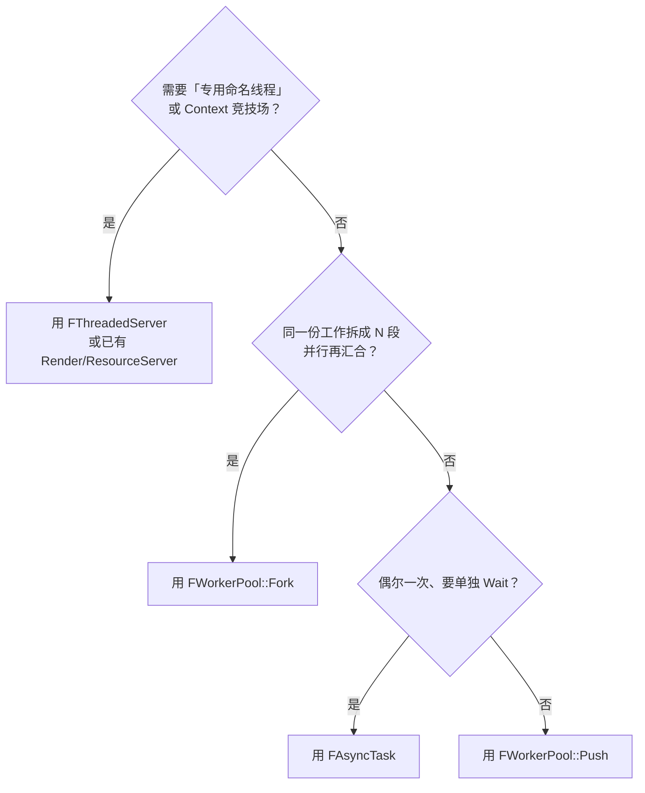
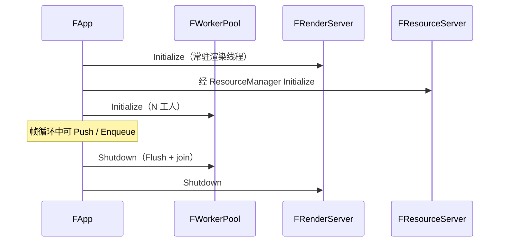

# Catty 三种异步工作模型对照

> 本文整理引擎里三套「把活丢到别的线程」的机制，方便选型。  
> 符号以当前源码为准：`FThreadedServer` / `FWorkerPool` / `FAsyncTask`。  
> 它们**都不是**线程安全的 Delegate；跨线程回调仍应回到游戏线程再播。

---

## 1. 一句话区分

| 模型 | 类 | 一句话 |
|------|-----|--------|
| **命名服务器线程** | `FThreadedServer`（及派生） | **一条**常驻专用线程 + 任务队列 + **Context 竞技场**；适合「这条线程有身份」（渲染 / 资源 IO） |
| **小工人池** | `FWorkerPool` | **N 条**常驻工人；`Fork(N, Body)` 按组并行（带组内 `WorkerIndex`），调用方自己切任务段；也可用 `Push` 丢零碎活 |
| **临时异步任务** | `FAsyncTask` | 每次 `Launch` **临时 new 一条线程**，`Wait` 等它结束；适合偶尔的一锤子活 |



---

## 2. 对照总表

| 维度 | `FThreadedServer` | `FWorkerPool` | `FAsyncTask` |
|------|-------------------|---------------|--------------|
| **线程数量** | 固定 **1** | 固定 **N**（CVar `worker.NumThreads`，0=自动 1~4） | 每次 Launch **+1**，Wait/析构后消失 |
| **生命周期** | `Initialize` ~ `Shutdown` 常驻 | 挂在 `FApp`，引擎初始化时启动 | 对象活多久线程就可能活多久 |
| **任务形态** | `FServerTask` / lambda，可带 `FTaskContextId` | `Fork`：`Body(WorkerIndex)`；`Push`：`void()` | `std::function<void()>` |
| **上下文** | 有：`AllocContext` / `GetContextAs`，任务结束自动回收 | lambda 捕获；用 `WorkerIndex` 查任务段 | 无（自己 capture） |
| **提交** | `Enqueue`（非阻塞） | `Fork`（阻塞到本组结束）/ `Push` | `Launch` / `LaunchNew` |
| **等待完成** | `Flush`（此前入队的全部做完） | `Fork` 自带汇合；`Flush` 等全部 Push | `Wait`（这一条）/ `IsDone` |
| **典型持有者** | `FRenderServer`、`FResourceServer` 等派生 | `FApp::WorkerPool` | 局部 / `unique_ptr`，谁用谁建 |
| **线程开销** | 低（一条养着） | 低（N 条养着） | 高（频繁 Launch 会抖） |
| **顺序** | **单线程 FIFO**，天然有序 | `Fork` 组内并行；多组/`Push` **不保证**全局序 | 单任务无序问题 |
| **像 UE 里的** | 具名线程 / 子系统工作线程 | `ParallelFor` 的底层池 + 索引工人 | `Async(..., Thread)` / 自管 `std::thread` |

---

## 3. 各自适合什么

### 3.1 `FThreadedServer` — 有名字的流水线

- 这条线程**有领域语义**：渲染线程、资源填充线程。
- 需要 **游戏线程填 Context → 工作线程消费 → 自动回收**。
- 要 **严格串行**（同一资源服务器上任务按序执行）。

```text
AllocContext →（游戏线程写 Path 等）→ Enqueue(task+id) → Execute → FreeContext
```

现成派生：

- `FRenderServer`：清屏 / Present / Resize 进渲染线程  
- `FResourceServer`：raw payload 异步填充（ResourceManager 内部）

头文件：`Catty/Server/ThreadedServer.h`

### 3.2 `FWorkerPool` — 按组并行（Fork）+ 可选 Push

主用途：把**同一份工作拆成 N 段并行**，再汇合。池**不**内置 `ParallelFor`——调用方 `Fork(N, Body)`，在 lambda 里用 **`WorkerIndex ∈ [0,N)`** 从自己捕获的 context 里取任务段。

```cpp
App.GetWorkerPool().Fork(4, [&Ctx](std::size_t WorkerIndex)
{
	const std::size_t Begin = Ctx.Count * WorkerIndex / 4;
	const std::size_t End = Ctx.Count * (WorkerIndex + 1) / 4;
	for (std::size_t I = Begin; I < End; ++I) { /* ... */ }
}); // 返回时 4 段都已做完
```

要点：

- Context 用捕获列表即可，不必进池子。  
- 调用线程跑 `WorkerIndex == 0`，其余进队列，避免在工人里再 `Fork` 时把自己卡死。  
- `Push` / `Flush` 仍可用于无关的零碎后台活。

头文件：`Catty/Core/WorkerPool.h`  
CVar：`worker.NumThreads`（模板 ini 已写）

### 3.3 `FAsyncTask` — 临时线程

- **偶发**、可能偏长、不想占满工人池的一锤子任务。
- 调用方要拿着句柄 **`Wait` / `IsDone`**，语义清晰。
- **不要**在热路径上疯狂 `Launch`（创建/销毁线程成本高）；那种场景改 `FWorkerPool::Push` 或 `Fork`。

头文件：`Catty/Core/AsyncTask.h`

---

## 4. 用法速查

### FThreadedServer（示意）

```cpp
struct FLoadContext : Catty::FTaskContext { std::string Path; };

const Catty::FTaskContextId Id = Server.AllocContext<FLoadContext>();
Server.GetContextAs<FLoadContext>(Id)->Path = "A.png";
Server.Enqueue([Id](Catty::FThreadedServer& S)
{
	auto* Ctx = S.GetContextAs<FLoadContext>(Id);
	// load Ctx->Path on the server thread
});
Server.Flush();
```

### FWorkerPool

```cpp
// Indexed fork (call-site ParallelFor):
const std::size_t Threads = 4;
App.GetWorkerPool().Fork(Threads, [&Ctx, Threads](std::size_t WorkerIndex)
{
	const std::size_t Begin = Ctx.Count * WorkerIndex / Threads;
	const std::size_t End = Ctx.Count * (WorkerIndex + 1) / Threads;
	for (std::size_t I = Begin; I < End; ++I) { /* segment */ }
});

// Optional unrelated jobs:
App.GetWorkerPool().Push([]() { /* ... */ });
App.GetWorkerPool().Flush();
```

### FAsyncTask

```cpp
auto Task = Catty::FAsyncTask::LaunchNew([]()
{
	// dedicated temporary thread
});
// ... optionally poll Task->IsDone()
Task->Wait();
```

---

## 5. 选型决策（简图）



补充：

- **要和 GPU / 交换链绑在一起的** → 走 `FRenderServer`（ThreadedServer），不要丢进 WorkerPool。  
- **Delegate 回调** → 默认仍假设游戏线程；工人线程里算完，应把结果 `Push` 回游戏线程再 `Broadcast` / 改共享状态（自行加同步）。

---

## 6. 和 App 生命周期的关系



`FAsyncTask` **不**挂在 App 上；用完即弃，析构会 `Wait`，避免线程悬空。

---

## 7. 相关源码路径

| 组件 | 公开头 | 实现 |
|------|--------|------|
| ThreadedServer | `Catty/Server/ThreadedServer.h` | `Private/Server/ThreadedServer.cpp` |
| WorkerPool | `Catty/Core/WorkerPool.h` | `Private/Core/WorkerPool.cpp` |
| AsyncTask | `Catty/Core/AsyncTask.h` | `Private/Core/AsyncTask.cpp` |
| App 挂接 | `Catty/Core/App.h` → `GetWorkerPool()` | `Private/Core/App.cpp` |
