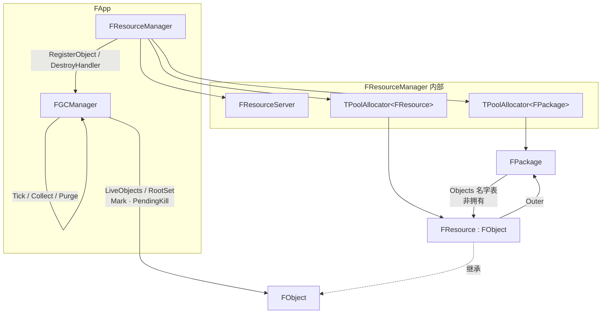
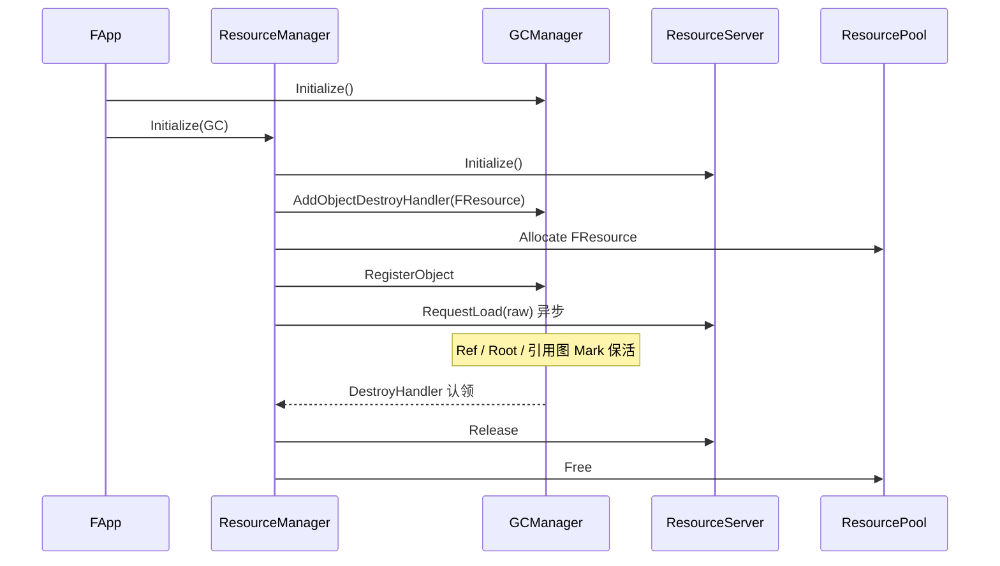
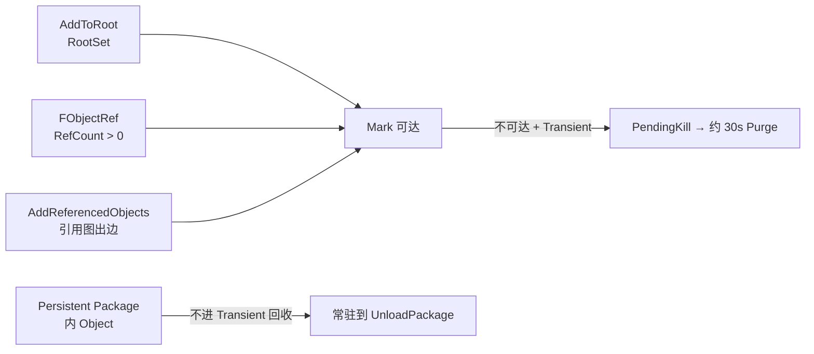

# Catty 引擎架构设计

> 本文描述 Catty 运行时模块关系，重点是 **FApp / FGCManager / FResourceManager / FPackage / FObject / FResource / FResourceServer**。  
> 符号与行为以当前引擎源码为准（Package 中心资源系统 + 类型无关 GC）。
>
> **看图请打开：** [引擎架构设计.html](./引擎架构设计.html)（浏览器渲染 Mermaid）。  
> Cursor / VS Code 默认 Markdown 预览**不会**把 \`\`\`mermaid 画成图，只会显示源码文本。

---

## 1. 总览

Catty 运行时由 `FApp` 持有并驱动各子系统。资源与对象相关的核心分工：

| 模块 | 管什么 | 不管什么 |
|------|--------|----------|
| **FApp** | 持有并驱动 GC / ResourceManager，帧循环 | 具体资源格式 |
| **FGCManager** | 登记、Root、引用图 Mark、PendingKill / Immediate、定时 Purge | `FResource` 池、如何读 png |
| **FResourceManager** | Package JSON、Objects 表、Resource/Package 池、**拥有** ResourceServer | 通用 Mark 算法 |
| **FPackage** | 包信息 + Objects 名字→指针 | 对象内存 |
| **FResource / FObject** | 身份、RefCount、出边 `AddReferencedObjects` | 自己 `new/delete` |
| **FResourceServer** | raw 异步填充（Manager 内部） | Package / GC |

---

## 2. 模块持有与依赖



要点：

- **GC 类型无关**：只看见 `FObject*`；具体池与 `ResourceServer::Release` 由 ResourceManager 的 destroy handler 认领。
- **Package 不拥有内存**：Objects 表只是登记；内存在 ResourceManager 的池里，生命周期策略由 GC 判定。
- **FApp 成员顺序**：`GCManager` 在 `ResourceManager` 之前构造，之后析构，保证 Manager Shutdown 时 GC 仍可用。
- **ResourceServer 下沉**：由 ResourceManager 拥有并 Init/Shutdown；App 不再直接持有。

---

## 3. 对象生命周期时序



同步 vs 异步边界：

| 操作 | 时机 |
|------|------|
| `LoadPackage` / `SavePackage` / `CreatePackage` / `CreateResource`（建对象） | **同步**（游戏线程立刻完成） |
| `ResourceServer::RequestLoad` 填 raw | **异步**（Pending → Ready/Failed） |
| `Flush(Resource)` | 等待**该**资源 raw 完成 |
| GC Collect / Purge | 与 raw IO 无关，只管 `FObject` 是否可回收 |

---

## 4. GC 保活与回收



### 4.1 Mark 种子

1. **RootSet**（`AddToRoot` / `RemoveFromRoot`，支持嵌套 `RootCount`）
2. **RefCount > 0**（`FObjectRef`；类型用 `Cast<T>()`）
3. **引用图**：从已 Mark 对象调用 `AddReferencedObjects` → `FReferenceCollector` 入队出边  
   - Outer/Package **不算**引用边（包常驻策略单独处理）

### 4.2 谁会被收

- 仅 **Transient Package** 内、Mark 后仍不可达、且未 Root 的对象 → 默认进 **PendingKill**
- `MarkForImmediateDestroy` → 当前 Tick 末 **Immediate** 回收
- **Persistent** Package 内 Object：不参与上述 Transient GC，卸包时由 ResourceManager 显式销毁

### 4.3 Tick 节奏（默认）

- 每帧：处理 Immediate 队列  
- 约 **1s**：`CollectGarbage`（Clear Reachable → Mark → 入 Pending/Immediate）  
- 约 **30s**：`PurgePendingKill`（再次 Mark 后真正 Free）

可通过 `FGCManager::SetCollectIntervalSeconds` / `SetPurgeIntervalSeconds` 调整。

---

## 5. 扩展新 FObject 子类型

GC **不必**为每个子类增加 API。新系统（例如 Audio）应：

```text
FAudioManager:
  自己的 TPoolAllocator<FXxx>
  Allocate → GC.RegisterObject
  GC.AddObjectDestroyHandler(认领 FXxx → 本 Manager 做特有清理 + Pool.Free)
  子类 override AddReferencedObjects 申报出边（可用 TObjectPtr）
```

ResourceManager 对 `FResource` 已是这一模式。

---

## 6. Package 用法（资源侧）

### 已有 JSON → 同步 LoadPackage

```cpp
FPackageRef Pkg = ResourceManager.LoadPackage("Content/Maps/Demo.pkg.json");
// Package + 包内对象已存在；raw 可能仍 Pending
FObjectRef Tex = ResourceManager.FindObject(Pkg, "T_Hero");
ResourceManager.Flush(Tex);
```

### 无 JSON → Create → Save

```cpp
FPackageRef Pkg = ResourceManager.CreatePackage(
	"/Game/Maps/Demo", EPackageFlags::Persistent);
FObjectRef Hero = ResourceManager.CreateResource(
	Pkg, "T_Hero", "Textures/T_Hero.png");
ResourceManager.SavePackage(Pkg, "Content/Maps/Demo.pkg.json");
```

Package JSON 只存清单（name / flags / objects 的 path·type），**不**嵌入 png/mesh 二进制。

---

## 7. 相关源码路径

| 内容 | 路径 |
|------|------|
| App | `Catty/Source/Public/Catty/Core/App.h` |
| GC | `Catty/Source/Public/Catty/Resource/GCManager.h` |
| 引用收集 | `Catty/Source/Public/Catty/Resource/ReferenceCollector.h` |
| Object | `Catty/Source/Public/Catty/Resource/Object.h` |
| Package | `Catty/Source/Public/Catty/Resource/Package.h` |
| Resource | `Catty/Source/Public/Catty/Resource/Resource.h` |
| ResourceManager | `Catty/Source/Public/Catty/Resource/ResourceManager.h` |
| 通用池 | `Catty/Source/Public/Catty/Core/PoolAllocator.h` |

---

## 8. 修订记录

| 日期 | 说明 |
|------|------|
| 2026-07 | 初版：Package 中心资源系统 + 类型无关 FGCManager + 最小引用图 |
