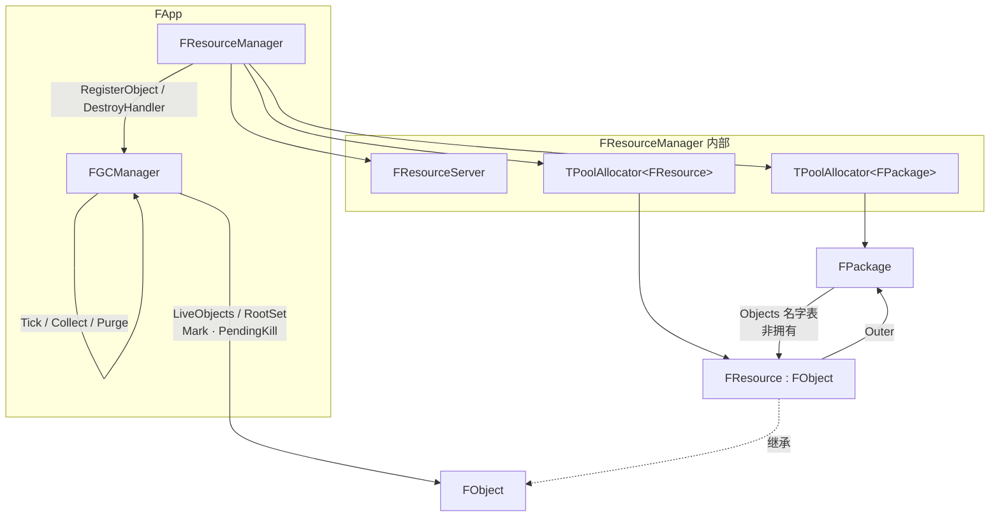
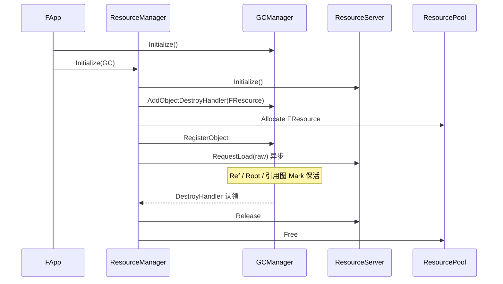
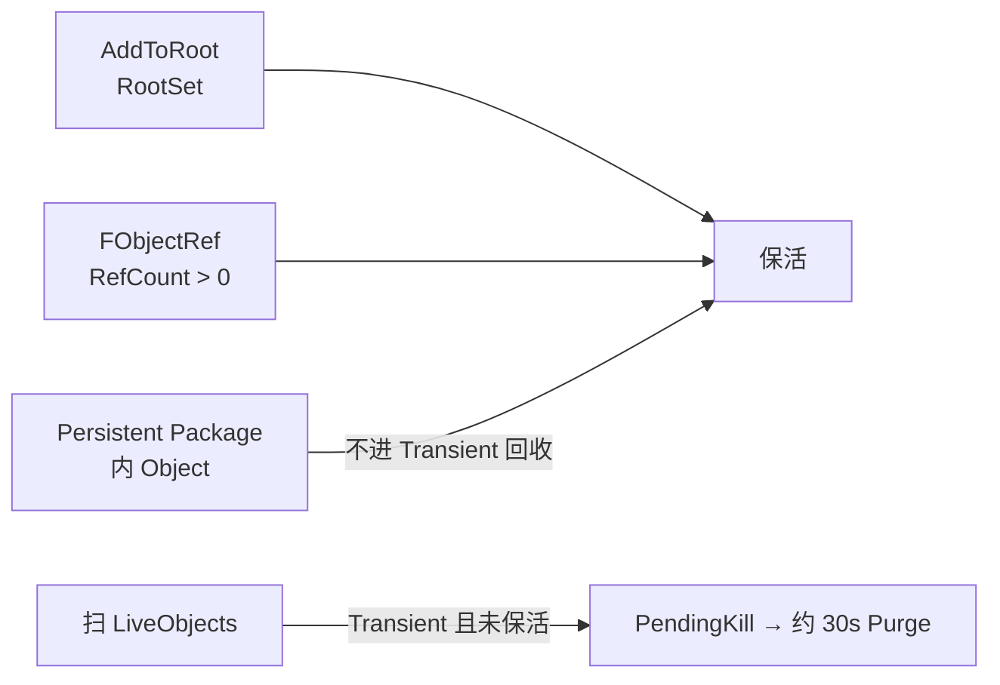

# Catty 引擎架构设计

> 本文描述 Catty 运行时模块关系，重点是 **FApp / FGCManager / FResourceManager / FPackage / FObject / FResource / FResourceServer**。  
> 符号与行为以当前引擎源码为准（Package 中心资源系统 + 类型无关 GC）。
>
> **看图请打开：** [引擎架构设计.html](./引擎架构设计.html)（浏览器渲染 Mermaid）。  
> Cursor / VS Code 默认 Markdown 预览**不会**把 \`\`\`mermaid 画成图，只会显示源码文本。
>
> **异步线程选型：** [异步工作模型对照.md](./异步工作模型对照.md)（`FThreadedServer` / `FWorkerPool` / `FAsyncTask`）。  
> **Lua 脚本：** [Lua脚本接入.md](./Lua脚本接入.md)（`FScriptSystem` + sol2）· 函数参考 [LuaAPI.html](./LuaAPI.html)。  
> **编译期反射：** [反射元数据.md](./反射元数据.md)（refl-cpp · `CATTY_REFLECT_*`）· 目录 [ReflectCatalog.md](./ReflectCatalog.md)。

---

## 1. 总览

Catty 运行时由 `FApp` 持有并驱动各子系统。资源与对象相关的核心分工：

| 模块 | 管什么 | 不管什么 |
|------|--------|----------|
| **FApp** | 持有并驱动 GC / ResourceManager，帧循环 | 具体资源格式 |
| **FGCManager** | 登记、Root、RefCount 扫描、PendingKill / Immediate、定时 Purge | `FResource` 池、如何读 png |
| **FResourceManager** | Package JSON、Objects 表、Resource/Package 池、**拥有** ResourceServer | 通用 GC 扫描 |
| **FPackage** | 包信息 + Objects 名字→指针 | 对象内存 |
| **FResource / FObject** | 身份、RefCount、Root | 自己 `new/delete` |
| **FResourceServer** | raw 异步填充（Manager 内部） | Package / GC |

---

## 2. 模块持有与依赖



要点：

- **GC 类型无关**：只看见 `FObject*`；具体池与 `ResourceServer::Release` 由 ResourceManager 的 destroy handler 认领。
- **Package 不拥有内存**：Objects 表只是登记；内存在 ResourceManager 的池里，生命周期策略由 GC 判定。
- **FApp 成员顺序**：`GCManager` 在 `ResourceManager` 之前构造，之后析构，保证 Manager Shutdown 时 GC 仍可用。
- **ResourceServer 下沉**：由 ResourceManager 拥有并 Init/Shutdown；App 不再直接持有。

---

## 3. 对象生命周期时序



同步 vs 异步边界：

| 操作 | 时机 |
|------|------|
| `LoadPackage` / `SavePackage` / `CreatePackage` / `CreateResource`（建对象） | **同步**（游戏线程立刻完成） |
| `ResourceServer::RequestLoad` 填 raw | **异步**（Pending → Ready/Failed） |
| `Flush(Resource)` | 等待**该**资源 raw 完成 |
| GC Collect / Purge | 与 raw IO 无关，只管 `FObject` 是否可回收 |

---

## 4. GC 保活与回收



### 4.1 保活条件

1. **RefCount > 0**（任意 `FObjectRef`，含 GC 的 `RootRefs` 列表、`Outer` 的 `FObjectRef` 等）
2. **AddToRoot**：`FGCManager::RootMap` 按对象去重，只持有一条 `FObjectRef`；嵌套用 `NestCount`
3. **无引用图遍历**：持有一律走 Ref。**互持 `FObjectRef` 会泄漏** — 环的一侧用 `FObjectWeakRef`，需要时 `Pin()`。

### 4.2 谁会被收（`IsGcEligible`）

- **FPackage**（`FObject` 子类）自身：无引用即可收
- Outer 为 **Transient**，或 Outer **已 Unload**（`!IsInCatalog`），或无 Outer
- 仍在 catalog 的 **Persistent** 包内容：不收，直到 `UnloadPackage` 摘名表
- `UnloadPackage` **只丢 catalog Ref**；包内 object 通过 Register 时的 pin 继续钉住 Package，Free 只走 GC

### 4.3 Tick 节奏（默认）

- 每帧：处理 Immediate 队列  
- 约 **1s**：`CollectGarbage`（扫 + Immediate Free）  
- 约 **30s**：`PurgePendingKill`

可通过 `FGCManager::SetCollectIntervalSeconds` / `SetPurgeIntervalSeconds` 调整。

---

## 5. 扩展新 FObject 子类型

GC **不必**为每个子类增加 API。新系统（例如 Audio）应：

```text
FAudioManager:
  自己的 TPoolAllocator<FXxx>
  Allocate → GC.RegisterObject
  GC.AddObjectDestroyHandler(认领 FXxx → 本 Manager 做特有清理 + Pool.Free)
  对外持有一律 FObjectRef（AddRef），不靠成员裸指针保活
```

ResourceManager 对 `FResource` 已是这一模式。

---

## 6. Package 用法（资源侧）

### 已有 JSON → 同步 LoadPackage

```cpp
FObjectRef Pkg = ResourceManager.LoadPackage("Content/Maps/Demo.pkg.json");
// Package + 包内对象已存在；raw 可能仍 Pending
FObjectRef Tex = ResourceManager.FindObject(Pkg, "T_Hero");
ResourceManager.Flush(Tex);
```

### 无 JSON → Create → Save

```cpp
FObjectRef Pkg = ResourceManager.CreatePackage(
	"/Game/Maps/Demo", EPackageFlags::Persistent);
FObjectRef Hero = ResourceManager.CreateResource(
	Pkg, "T_Hero", "Textures/T_Hero.png");
ResourceManager.SavePackage(Pkg, "Content/Maps/Demo.pkg.json");
```

Package JSON 含 `objects` 清单与 `dependencies`（跨包引用收集自 `GetReferencedObjects`）。  
`UnloadPackage` 只摘名表并 Release catalog Ref；包与对象由 GC 在 RefCount 归零后 Free。  
`SavePackage(..., bSaveDependencies=true)` 会先递归保存依赖包；依赖未加载或缺少 file 路径时 **失败**。

---

## 7. 相关源码路径

| 内容 | 路径 |
|------|------|
| App | `Catty/Source/Public/Catty/Core/App.h` |
| GC | `Catty/Source/Public/Catty/Resource/GCManager.h` |
| Object | `Catty/Source/Public/Catty/Resource/Object.h` |
| Package | `Catty/Source/Public/Catty/Resource/Package.h` |
| Resource | `Catty/Source/Public/Catty/Resource/Resource.h` |
| ResourceManager | `Catty/Source/Public/Catty/Resource/ResourceManager.h` |
| 通用池 | `Catty/Source/Public/Catty/Core/PoolAllocator.h` |

---

## 8. 修订记录

| 日期 | 说明 |
|------|------|
| 2026-07 | 初版：Package 中心资源系统 + 类型无关 FGCManager |
| 2026-07 | GC 改为 Root/RefCount 扫描，去掉引用图 Mark |
| 2026-07 | Package dependencies + refs 递归 Save/Load |
| 2026-07 | Unload/Shutdown Ref 安全；Mark 入队；WeakRef 破环；Save 依赖缺 file 失败 |
| 2026-07 | FPackage 继承 FObject，Unload 只摘 catalog，生命周期交 GC |
